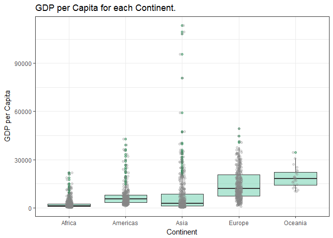
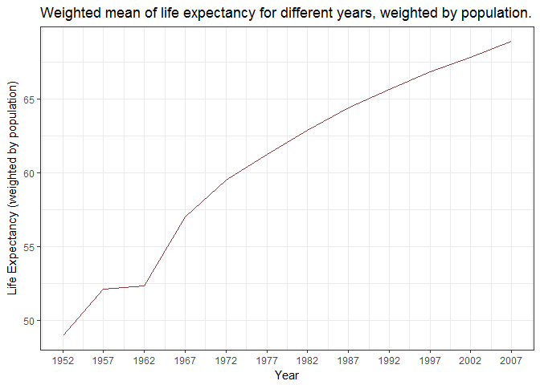
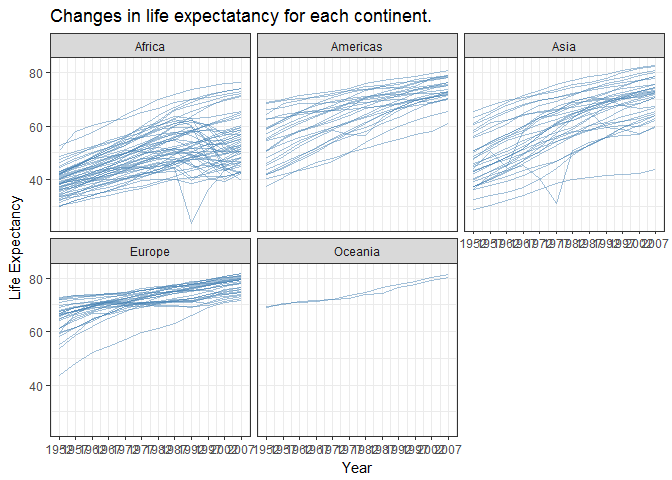
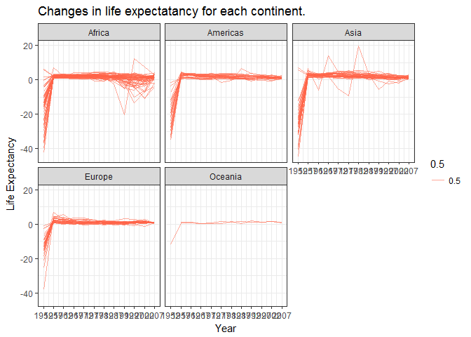
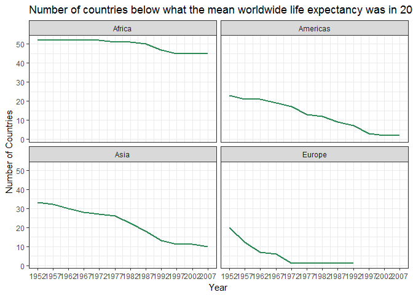

Homework 3
================
Victoria Michalowski
October 3, 2017

``` r
suppressPackageStartupMessages(library(ggplot2))
```

    ## Warning: package 'ggplot2' was built under R version 3.3.2

``` r
suppressPackageStartupMessages(library(tidyverse))
```

    ## Warning: package 'tidyverse' was built under R version 3.3.3

    ## Warning: package 'tidyr' was built under R version 3.3.3

    ## Warning: package 'readr' was built under R version 3.3.2

    ## Warning: package 'purrr' was built under R version 3.3.3

    ## Warning: package 'dplyr' was built under R version 3.3.3

``` r
suppressPackageStartupMessages(library(gapminder))
```

    ## Warning: package 'gapminder' was built under R version 3.3.3

TASK 1. Get the maximum and minimum of GDP per capita for all continents.
=========================================================================

``` r
#Table
gapminder %>%
  group_by(continent) %>% 
  summarize(min_gdpPercap = min(gdpPercap), max_gdpPercap = max(gdpPercap))
```

    ## # A tibble: 5 × 3
    ##   continent min_gdpPercap max_gdpPercap
    ##      <fctr>         <dbl>         <dbl>
    ## 1    Africa      241.1659      21951.21
    ## 2  Americas     1201.6372      42951.65
    ## 3      Asia      331.0000     113523.13
    ## 4    Europe      973.5332      49357.19
    ## 5   Oceania    10039.5956      34435.37

``` r
#Figure
gapminder %>%
ggplot(aes(x=continent, y=gdpPercap)) + geom_boxplot(outlier.colour="seagreen", outlier.alpha=0.5, fill="mediumaquamarine", alpha = 0.5) + geom_jitter(width=0.05, alpha=0.25, colour="gray52") + scale_y_continuous(name = "GDP per Capita") + scale_x_discrete(name = "Continent") + ggtitle("GDP per Capita for each Continent.") + theme_bw()
```



Overall, the table tells us that Oceania has the highest minimum GDP per capita, while Africa has the lowest. Asia has the highest maximum GDP per capita, while again, Africa has the lowest. Examining the spread of GDP per capita in each continent through a boxplot figure, Africa and Oceania both have small spreads with relatively few outlieres, although Oceania has the highest mean GDP per capita across all continents, while Africa has the lowest mean. Asia's mean GDP per capita is similar to Africa's, but it has the largest range across all continents, and the highest GDP per capita overall.

TASK 2. Compute a trimmed mean of life expectancy for different years. Or a weighted mean, weighting by population. Just try something other than the plain vanilla mean.
=========================================================================================================================================================================

``` r
#Table
gapminder %>%
  group_by(year) %>%
  summarize(wm_lifeExp = weighted.mean(lifeExp, pop))
```

    ## # A tibble: 12 × 2
    ##     year wm_lifeExp
    ##    <int>      <dbl>
    ## 1   1952   48.94424
    ## 2   1957   52.12189
    ## 3   1962   52.32438
    ## 4   1967   56.98431
    ## 5   1972   59.51478
    ## 6   1977   61.23726
    ## 7   1982   62.88176
    ## 8   1987   64.41635
    ## 9   1992   65.64590
    ## 10  1997   66.84934
    ## 11  2002   67.83904
    ## 12  2007   68.91909

``` r
#Figure
gapminder %>% 
  group_by(year) %>% 
  mutate(wm_lifeExp = weighted.mean(lifeExp, pop)) %>%
  select(year, wm_lifeExp) %>% 
  ggplot(aes(x=year, y=wm_lifeExp)) + 
    geom_line(colour="indianred4") + 
    scale_y_continuous(name="Life Expectancy (weighted by population)") + 
    scale_x_continuous(name="Year", breaks=c(1952, 1957, 1962, 1967, 1972, 1977, 1982, 1987, 1992, 1997, 2002, 2007)) + 
    ggtitle("Weighted mean of life expectancy for different years, weighted by population.") + 
    theme_bw()
```



Life expectancy, when weighted by population, shows a steady increase from 1952 until 2007. The exception is for the 1957 until 1962 measurement points, when life expectancy seemed to stagnate.

TASK 3. How is life expectancy changing over time on different continents?
==========================================================================

``` r
#Tables
gapminder %>%
  select(continent, lifeExp, year) %>% 
  group_by(continent, year) %>%
  summarize(m_lifeExp = mean(lifeExp)) #mean life expectancy
```

    ## Source: local data frame [60 x 3]
    ## Groups: continent [?]
    ## 
    ##    continent  year m_lifeExp
    ##       <fctr> <int>     <dbl>
    ## 1     Africa  1952  39.13550
    ## 2     Africa  1957  41.26635
    ## 3     Africa  1962  43.31944
    ## 4     Africa  1967  45.33454
    ## 5     Africa  1972  47.45094
    ## 6     Africa  1977  49.58042
    ## 7     Africa  1982  51.59287
    ## 8     Africa  1987  53.34479
    ## 9     Africa  1992  53.62958
    ## 10    Africa  1997  53.59827
    ## # ... with 50 more rows

``` r
gapminder %>%
  select(continent, lifeExp, year) %>% 
  group_by(continent) %>%
  mutate(le_delta = lifeExp - lag(lifeExp)) %>% #difference in life expectancy from one assessment to the next
  summarize(m_le_delta = mean(le_delta, na.rm=TRUE)) %>% #mean difference in life expectancy
  arrange(m_le_delta)
```

    ## # A tibble: 5 × 2
    ##   continent   m_le_delta
    ##      <fctr>        <dbl>
    ## 1    Africa 0.0006581059
    ## 2  Americas 0.0376655518
    ## 3    Europe 0.0673955432
    ## 4      Asia 0.0858151899
    ## 5   Oceania 0.4819130435

``` r
#Figures
gapminder %>%
  group_by(country) %>% 
  select(continent, country, lifeExp) %>% 
  summarize(min_lifeExp = min(lifeExp), max_lifeExp = max(lifeExp))
```

    ## # A tibble: 142 × 3
    ##        country min_lifeExp max_lifeExp
    ##         <fctr>       <dbl>       <dbl>
    ## 1  Afghanistan      28.801      43.828
    ## 2      Albania      55.230      76.423
    ## 3      Algeria      43.077      72.301
    ## 4       Angola      30.015      42.731
    ## 5    Argentina      62.485      75.320
    ## 6    Australia      69.120      81.235
    ## 7      Austria      66.800      79.829
    ## 8      Bahrain      50.939      75.635
    ## 9   Bangladesh      37.484      64.062
    ## 10     Belgium      68.000      79.441
    ## # ... with 132 more rows

``` r
gapminder %>%
  ggplot(aes(x=year,y=lifeExp, group=country)) +
  facet_wrap(~continent) +
  geom_line(aes(year, lifeExp), alpha=0.5, colour="steelblue") +
  scale_y_continuous(name="Life Expectancy") + 
  scale_x_continuous(name="Year", breaks=c(1952, 1957, 1962, 1967, 1972, 1977, 1982, 1987, 1992, 1997, 2002, 2007)) + 
  ggtitle("Changes in life expectatancy for each continent.") +
  theme_bw()
```



``` r
gapminder %>%
  group_by(continent) %>%
  mutate(le_delta = lifeExp - lag(lifeExp)) %>% #difference in life expectancy
  ggplot(aes(x=year,y=le_delta, group=country)) +
  facet_wrap(~continent) +
  geom_line(aes(year, le_delta, alpha=0.5), colour="tomato") +
  scale_y_continuous(name="Life Expectancy") + 
  scale_x_continuous(name="Year", breaks=c(1952, 1957, 1962, 1967, 1972, 1977, 1982, 1987, 1992, 1997, 2002, 2007)) + 
  ggtitle("Changes in life expectatancy for each continent.") +
  theme_bw()
```

    ## Warning: Removed 5 rows containing missing values (geom_path).



Here, I tried to explore how to look at changes in life expectancy for each continent, in more than one way.

The first I tried was by looking at plain mean life expectancy (averaged across countries in each continent) for each continent, and then created a spaghetti plot for each continent to visualize how life expectancy across all countries in a continent would appear.

Plotting life expectancy for each continent shows that life expectancy generally increases across all continents, with Asia and Africa showing the greatest spread in life expectancy, while Oceania and Europe have a relatively tight spread in life expectancy across countries within those continents.

Next, I tried to looked at lagged life expectancy, where the difference between years in life expectancy was averaged for each continent in the table. Here, we can see that Africa on average has little change in life expectancy, whereas Oceania has the largest.

I then tried plotting lagged life expectancy (i.e. the difference in life expectancy from one year to the next), again using spaghetti plots. These are harder for me to interpret, and after thinking about it, I'm still not sure I know what to make of them. It makes sense that there would be a jump from the first year to the next, since 1952 would have no difference score with a previous measurement point. But then life expectancy seems to flatten, with some exceptions where there are spikes. My guess is that it could mean the difference between life expectancy from one year to a next is generally stable across continents, and for most countries; the spikes would be for points where the life expectancy is dramatically different from one year to the next.

TASK 4. Report the absolute and/or relative abundance of countries with low life expectancy over time by continent: Compute some measure of worldwide life expectancy - you decide - a mean or median or some other quantile or perhaps your current age. Then determine how many countries on each continent have a life expectancy less than this benchmark, for each year.
=============================================================================================================================================================================================================================================================================================================================================================================

``` r
#Compute benchmark age
gapminder %>% 
  filter(year==2007) %>% 
  summarize(m_lifeExp = mean(lifeExp)) #Mean worldwide life expectancy in 2007: 67.00742
```

    ## # A tibble: 1 × 1
    ##   m_lifeExp
    ##       <dbl>
    ## 1  67.00742

``` r
m_lifeExp <- 67.00742

#Table
gapminder %>%
  group_by(continent, year) %>% 
  filter(lifeExp < m_lifeExp) %>%
  summarize(n_countries = n_distinct(country)) %>% 
  arrange(n_countries)
```

    ## Source: local data frame [45 x 3]
    ## Groups: continent [4]
    ## 
    ##    continent  year n_countries
    ##       <fctr> <int>       <int>
    ## 1     Europe  1972           1
    ## 2     Europe  1977           1
    ## 3     Europe  1982           1
    ## 4     Europe  1987           1
    ## 5     Europe  1992           1
    ## 6   Americas  2002           2
    ## 7   Americas  2007           2
    ## 8   Americas  1997           3
    ## 9     Europe  1967           6
    ## 10  Americas  1992           7
    ## # ... with 35 more rows

``` r
#Figure
gapminder %>% 
  group_by(continent, year) %>% 
  filter(lifeExp < m_lifeExp) %>%
  mutate(n_countries = n_distinct(country)) %>% 
  ggplot(aes(x=year, y=n_countries), group=country) + 
    facet_wrap(~continent) +
    geom_line(aes(year, n_countries), colour="seagreen", size=1) +
    scale_y_continuous(name="Number of Countries") + 
    scale_x_continuous(name="Year", breaks=c(1952, 1957, 1962, 1967, 1972, 1977, 1982, 1987, 1992, 1997, 2002, 2007)) + 
    ggtitle("Number of countries below what the mean worldwide life expectancy was in 2007.") +
    theme_bw()
```



The benchmark age I used was the mean life expectancy worldwide, in 2007: 67.00742.

From the table, we can see that Europe in the 70s, 80s, and early 90s has the least number of countries with life expectancy less than this benchmark, while Africa had the most through all years of data collection.

The figure reiterates this, with Africa clearly showing the highest, and most stable line across all continents.

Some issues with this code is that 0 was not included in the count. Hence, Oceania across all measurement points, and Europe since the late 90s, do not show a line and are not included in the data visualization.
