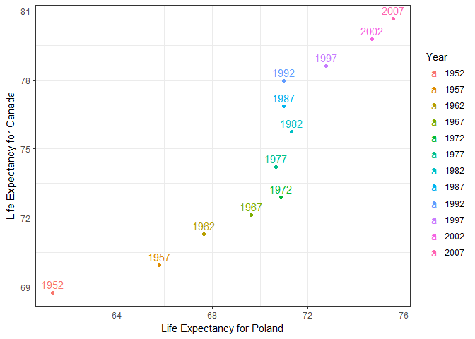
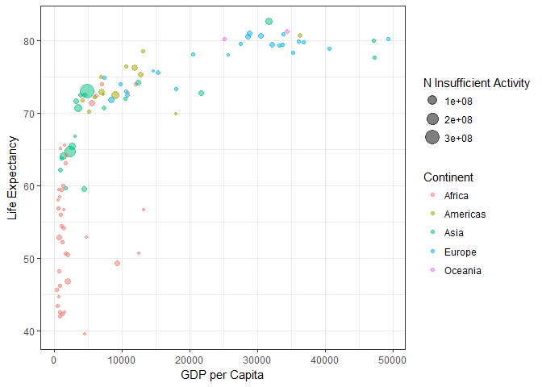
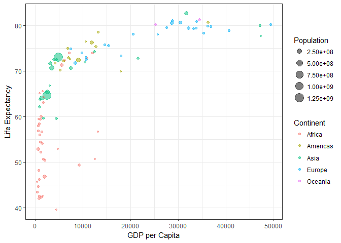

hw04
================
Victoria Michalowski
October 10, 2017

``` r
suppressPackageStartupMessages(library(tidyverse))
```

    ## Warning: package 'tidyverse' was built under R version 3.3.3

    ## Warning: package 'ggplot2' was built under R version 3.3.2

    ## Warning: package 'tidyr' was built under R version 3.3.3

    ## Warning: package 'readr' was built under R version 3.3.2

    ## Warning: package 'purrr' was built under R version 3.3.3

    ## Warning: package 'dplyr' was built under R version 3.3.3

``` r
suppressPackageStartupMessages(library(ggplot2))
suppressPackageStartupMessages(library(gapminder))
```

    ## Warning: package 'gapminder' was built under R version 3.3.3

``` r
suppressPackageStartupMessages(library(plyr))
```

    ## Warning: package 'plyr' was built under R version 3.3.2

General data reshaping and relationship to aggregation.
=======================================================

Activity \#2.
-------------

-   Make a tibble with one row per year and columns for life expectancy for two or more countries.
-   Use knitr::kable() to make this table look pretty in your rendered homework.
-   Take advantage of this new data shape to scatterplot life expectancy for one country against that of another.

For this activity, I decided to follow up on my work in Homework 2, where I compared Poland and Canada across time. Here, I re-structured the data so that there is one row per year, and one column for Life Expectancy for Canada, and another for Life Expectancy for Poland.

``` r
#created a tibble that only included life expectancy for Canada
gapminderA <- gapminder %>% 
  select(year, country, lifeExp) %>% 
  filter(country=="Canada") %>% 
  select(year, lifeExp) %>% 
  rename(c("lifeExp" = "Canada_lifeExp"))

#created another tibble, this time including only life expectancy for Poland
gapminderB <- gapminder %>% 
  select(year, country, lifeExp) %>% 
  filter(country=="Poland") %>% 
  select(year, lifeExp) %>% 
  rename(c("lifeExp" = "Poland_lifeExp"))

#joined the two tibbles, so that there was one row for each year, and a column for life expectancy of Poland, and another such column for Canada
gapminderC <- left_join(gapminderA, gapminderB)
```

    ## Joining, by = "year"

``` r
#used the knitr::kable() function to make the table look pretty
knitr::kable(gapminderC)
```

|  year|  Canada\_lifeExp|  Poland\_lifeExp|
|-----:|----------------:|----------------:|
|  1952|           68.750|           61.310|
|  1957|           69.960|           65.770|
|  1962|           71.300|           67.640|
|  1967|           72.130|           69.610|
|  1972|           72.880|           70.850|
|  1977|           74.210|           70.670|
|  1982|           75.760|           71.320|
|  1987|           76.860|           70.980|
|  1992|           77.950|           70.990|
|  1997|           78.610|           72.750|
|  2002|           79.770|           74.670|
|  2007|           80.653|           75.563|

``` r
#created a discrete year variable, so that I could have a seperate colour for each year on the graph
gapminderC$year_discrete <- as.factor(gapminderC$year)

gapminderC %>% 
ggplot(aes(x=Poland_lifeExp, y=Canada_lifeExp, label=year_discrete)) + 
  geom_point(aes(colour=year_discrete)) + #plotting points
  geom_text(aes(colour=year_discrete), hjust=0.5, vjust=-0.5) + #plotting year labels on above points
  scale_colour_discrete("Year") + #seperate colour for each year
  scale_x_continuous(name="Life Expectancy for Poland") + 
  scale_y_continuous(name="Life Expectancy for Canada") +
  theme_bw()
```



Plotting life expectancy for each country, it's clear that both countries enjoyed an increase in life expectancy in more recent years, but also that life expectancy for Poland stagnated from 1972 until 1992, and then finally began to increase along with Canada again in 1997.

Join, merge, look up.
=====================

Activity \#1.
-------------

-   Create a second data frame, complementary to Gapminder. Join this with (part of) Gapminder using a dplyr join function and make some observations about the process and result.
-   Explore the different types of joins.

For this activity I decided used data from the World Health Organization (WHO). They had an interesting data set for the percentage of insufficiently active individuals in each country \[<http://apps.who.int/gho/data/node.main.A893?lang=en>\]. I thought this kind of information would nicely compliment variables already in the gapminder data set. Unfortunately, the WHO data was only collected in 2010, and so to match up with the gapminder data, I decided to only include gapminder data from 2007, the closest year in the gapminder data set to the 2010 WHO data.

``` r
who_pa_data <- read.csv("WHO_pa_data.csv", header=TRUE) #import WHO data
str(who_pa_data) #check out the newly imported data
```

    ## 'data.frame':    194 obs. of  4 variables:
    ##  $ Country                                          : Factor w/ 194 levels "Afghanistan",..: 1 2 3 4 5 6 7 8 9 10 ...
    ##  $ Year                                             : int  2010 2010 2010 2010 2010 2010 2010 2010 2010 2010 ...
    ##  $ Age.Group                                        : Factor w/ 1 level "18+  years": 1 1 1 1 1 1 1 1 1 1 ...
    ##  $ Insufficiently.active..age.standardized.estimate.: num  NA NA 34.4 26.1 NA NA 39.2 NA 23.8 23.8 ...

``` r
#clean up the imported data
who_pa_data_A <- who_pa_data %>% 
  rename(c("Insufficiently.active..age.standardized.estimate." = "insuffAct")) %>% 
  rename(c("Country" = "country")) %>%
  select(country, insuffAct)

#prep the data for joining
gapminderD <- gapminder %>%
  filter(year==2007) #activity data is only available for 2010 in the WHO data, so decided to only use gapminder data from 2007, the closest year to 2010
gapminderD #check out the data
```

    ## # A tibble: 142 × 6
    ##        country continent  year lifeExp       pop  gdpPercap
    ##         <fctr>    <fctr> <int>   <dbl>     <int>      <dbl>
    ## 1  Afghanistan      Asia  2007  43.828  31889923   974.5803
    ## 2      Albania    Europe  2007  76.423   3600523  5937.0295
    ## 3      Algeria    Africa  2007  72.301  33333216  6223.3675
    ## 4       Angola    Africa  2007  42.731  12420476  4797.2313
    ## 5    Argentina  Americas  2007  75.320  40301927 12779.3796
    ## 6    Australia   Oceania  2007  81.235  20434176 34435.3674
    ## 7      Austria    Europe  2007  79.829   8199783 36126.4927
    ## 8      Bahrain      Asia  2007  75.635    708573 29796.0483
    ## 9   Bangladesh      Asia  2007  64.062 150448339  1391.2538
    ## 10     Belgium    Europe  2007  79.441  10392226 33692.6051
    ## # ... with 132 more rows

``` r
#joining the data sets
who_gapminder <- left_join(gapminderD, who_pa_data_A) #join gapminder and who data
```

    ## Joining, by = "country"

    ## Warning in left_join_impl(x, y, by$x, by$y, suffix$x, suffix$y): joining
    ## factors with different levels, coercing to character vector

``` r
who_gapminder #check out the data
```

    ## # A tibble: 142 × 7
    ##        country continent  year lifeExp       pop  gdpPercap insuffAct
    ##          <chr>    <fctr> <int>   <dbl>     <int>      <dbl>     <dbl>
    ## 1  Afghanistan      Asia  2007  43.828  31889923   974.5803        NA
    ## 2      Albania    Europe  2007  76.423   3600523  5937.0295        NA
    ## 3      Algeria    Africa  2007  72.301  33333216  6223.3675      34.4
    ## 4       Angola    Africa  2007  42.731  12420476  4797.2313        NA
    ## 5    Argentina  Americas  2007  75.320  40301927 12779.3796      39.2
    ## 6    Australia   Oceania  2007  81.235  20434176 34435.3674      23.8
    ## 7      Austria    Europe  2007  79.829   8199783 36126.4927      23.8
    ## 8      Bahrain      Asia  2007  75.635    708573 29796.0483        NA
    ## 9   Bangladesh      Asia  2007  64.062 150448339  1391.2538      26.8
    ## 10     Belgium    Europe  2007  79.441  10392226 33692.6051      33.2
    ## # ... with 132 more rows

``` r
who_gapminderC <- who_gapminder %>% 
  filter(insuffAct >= 0) %>%  #remove countries missing WHO activity data
  mutate(n_insuffAct = ((insuffAct/100)*pop)) #convert percentage of population that is insufficiently active into an actual number of people who are insufficiently active, by mutiplying % by population
who_gapminderC #check out the data
```

    ## # A tibble: 96 × 8
    ##                   country continent  year lifeExp       pop gdpPercap
    ##                     <chr>    <fctr> <int>   <dbl>     <int>     <dbl>
    ## 1                 Algeria    Africa  2007  72.301  33333216  6223.367
    ## 2               Argentina  Americas  2007  75.320  40301927 12779.380
    ## 3               Australia   Oceania  2007  81.235  20434176 34435.367
    ## 4                 Austria    Europe  2007  79.829   8199783 36126.493
    ## 5              Bangladesh      Asia  2007  64.062 150448339  1391.254
    ## 6                 Belgium    Europe  2007  79.441  10392226 33692.605
    ## 7                   Benin    Africa  2007  56.728   8078314  1441.285
    ## 8  Bosnia and Herzegovina    Europe  2007  74.852   4552198  7446.299
    ## 9                Botswana    Africa  2007  50.728   1639131 12569.852
    ## 10                 Brazil  Americas  2007  72.390 190010647  9065.801
    ## # ... with 86 more rows, and 2 more variables: insuffAct <dbl>,
    ## #   n_insuffAct <dbl>

``` r
who_gapminderC %>% 
  ggplot(aes(x=gdpPercap, y=lifeExp)) +
  geom_point(aes(size=n_insuffAct, colour=continent), alpha=0.5) + #size points by number of people who are insufficiently active, and colour points by continent membership
  scale_size_continuous("N Insufficient Activity") + #rename size legend
  scale_colour_discrete("Continent") + #rename colour legend
  scale_x_continuous(name="GDP per Capita") + 
  scale_y_continuous(name="Life Expectancy") +
  theme_bw()
```



``` r
who_gapminderC %>% 
  ggplot(aes(x=gdpPercap, y=lifeExp)) +
  geom_point(aes(size=pop, colour=continent), alpha=0.5) + #size points by population, and colour points by continent membership
  scale_size_continuous("Population") + #rename size legend
  scale_colour_discrete("Continent") + #rename colour legend
  scale_x_continuous(name="GDP per Capita") + 
  scale_y_continuous(name="Life Expectancy") +
  theme_bw()
```



Through this graph, I was hoping to see whether there is a pattern where the number of people who are insufficiently active is reflected in life expectancy, or its relationship with GDP per capita. I can't make any inferences on that based on this graph, but I do notice that most countries have relatively similarly sized points. Hence, there seems to be a small spread in the WHO activity data. The notable exception would be certain countries in Asia, which seem to have the largest number of people who are insufficiently active. This may have to do with the fact that these countries generally have a large population though.

EXTRA: join() versus merge().
=============================

``` r
#using the join() function
who_gapminder <- left_join(gapminderD, who_pa_data_A) #join gapminder and who data
```

    ## Joining, by = "country"

    ## Warning in left_join_impl(x, y, by$x, by$y, suffix$x, suffix$y): joining
    ## factors with different levels, coercing to character vector

``` r
str(who_gapminder) #check out the data
```

    ## Classes 'tbl_df', 'tbl' and 'data.frame':    142 obs. of  7 variables:
    ##  $ country  : chr  "Afghanistan" "Albania" "Algeria" "Angola" ...
    ##  $ continent: Factor w/ 5 levels "Africa","Americas",..: 3 4 1 1 2 5 4 3 3 4 ...
    ##  $ year     : int  2007 2007 2007 2007 2007 2007 2007 2007 2007 2007 ...
    ##  $ lifeExp  : num  43.8 76.4 72.3 42.7 75.3 ...
    ##  $ pop      : int  31889923 3600523 33333216 12420476 40301927 20434176 8199783 708573 150448339 10392226 ...
    ##  $ gdpPercap: num  975 5937 6223 4797 12779 ...
    ##  $ insuffAct: num  NA NA 34.4 NA 39.2 23.8 23.8 NA 26.8 33.2 ...

Using the left\_join() function retains all of the data from both the gapminder and WHO data sets, as evidenced by the 142 observations. So, if one data set does not have value x on the joining variable, then that's okay - the joined data.frame will still include value x.

For example, let's take a look the gapminder data:

``` r
head(gapminderD)
```

    ## # A tibble: 6 × 6
    ##       country continent  year lifeExp      pop  gdpPercap
    ##        <fctr>    <fctr> <int>   <dbl>    <int>      <dbl>
    ## 1 Afghanistan      Asia  2007  43.828 31889923   974.5803
    ## 2     Albania    Europe  2007  76.423  3600523  5937.0295
    ## 3     Algeria    Africa  2007  72.301 33333216  6223.3675
    ## 4      Angola    Africa  2007  42.731 12420476  4797.2313
    ## 5   Argentina  Americas  2007  75.320 40301927 12779.3796
    ## 6   Australia   Oceania  2007  81.235 20434176 34435.3674

And then at the WHO data:

``` r
head(who_pa_data_A)
```

    ##               country insuffAct
    ## 1         Afghanistan        NA
    ## 2             Albania        NA
    ## 3             Algeria      34.4
    ## 4             Andorra      26.1
    ## 5              Angola        NA
    ## 6 Antigua and Barbuda        NA

It looks like the WHO data set includes Andorra, but the gapminder data set does not.

So how does join() handle this?

``` r
head(who_gapminder)
```

    ## # A tibble: 6 × 7
    ##       country continent  year lifeExp      pop  gdpPercap insuffAct
    ##         <chr>    <fctr> <int>   <dbl>    <int>      <dbl>     <dbl>
    ## 1 Afghanistan      Asia  2007  43.828 31889923   974.5803        NA
    ## 2     Albania    Europe  2007  76.423  3600523  5937.0295        NA
    ## 3     Algeria    Africa  2007  72.301 33333216  6223.3675      34.4
    ## 4      Angola    Africa  2007  42.731 12420476  4797.2313        NA
    ## 5   Argentina  Americas  2007  75.320 40301927 12779.3796      39.2
    ## 6   Australia   Oceania  2007  81.235 20434176 34435.3674      23.8

It looks like our new joined data does not include Andorra.

Why? Because we specified gapminder as the first data set in our join function, and this is the one that will be joined to. So if gapminder has a country that WHO doesn't, that's okay - it will be included. But if WHO has a country that gapminder doesn't, then it won't be included.

For example, WHO does not include West Bank and Gaza as a country, but gapminder does.

``` r
tail(gapminderD)
```

    ## # A tibble: 6 × 6
    ##              country continent  year lifeExp      pop  gdpPercap
    ##               <fctr>    <fctr> <int>   <dbl>    <int>      <dbl>
    ## 1          Venezuela  Americas  2007  73.747 26084662 11415.8057
    ## 2            Vietnam      Asia  2007  74.249 85262356  2441.5764
    ## 3 West Bank and Gaza      Asia  2007  73.422  4018332  3025.3498
    ## 4        Yemen, Rep.      Asia  2007  62.698 22211743  2280.7699
    ## 5             Zambia    Africa  2007  42.384 11746035  1271.2116
    ## 6           Zimbabwe    Africa  2007  43.487 12311143   469.7093

``` r
tail(who_pa_data_A)
```

    ##                                country insuffAct
    ## 189                            Vanuatu       8.4
    ## 190 Venezuela (Bolivarian Republic of)        NA
    ## 191                           Viet Nam      23.9
    ## 192                              Yemen        NA
    ## 193                             Zambia      20.5
    ## 194                           Zimbabwe      22.4

``` r
tail(who_gapminder)
```

    ## # A tibble: 6 × 7
    ##              country continent  year lifeExp      pop  gdpPercap insuffAct
    ##                <chr>    <fctr> <int>   <dbl>    <int>      <dbl>     <dbl>
    ## 1          Venezuela  Americas  2007  73.747 26084662 11415.8057        NA
    ## 2            Vietnam      Asia  2007  74.249 85262356  2441.5764        NA
    ## 3 West Bank and Gaza      Asia  2007  73.422  4018332  3025.3498        NA
    ## 4        Yemen, Rep.      Asia  2007  62.698 22211743  2280.7699        NA
    ## 5             Zambia    Africa  2007  42.384 11746035  1271.2116      20.5
    ## 6           Zimbabwe    Africa  2007  43.487 12311143   469.7093      22.4

And as we can see, that is okay, because join() will still include West Bank and Gaza in the joined data set.

So what happens when we use the merge() function instead?

Here, it looks like merge() cuts down the observations to 121, meaning that it only preserves data that is common to both variables in each data set. So this time, if WHO doesn't have a country that gapminder does, it will not be included in the newly merged data.

``` r
#using the merge() function
who_gapminder_Mrg <- merge(gapminderD, who_pa_data_A) #join gapminder and who data
str(who_gapminder_Mrg) #check out the data
```

    ## 'data.frame':    121 obs. of  7 variables:
    ##  $ country  : Factor w/ 142 levels "Afghanistan",..: 1 2 3 4 5 6 7 8 9 10 ...
    ##  $ continent: Factor w/ 5 levels "Africa","Americas",..: 3 4 1 1 2 5 4 3 3 4 ...
    ##  $ year     : int  2007 2007 2007 2007 2007 2007 2007 2007 2007 2007 ...
    ##  $ lifeExp  : num  43.8 76.4 72.3 42.7 75.3 ...
    ##  $ pop      : int  31889923 3600523 33333216 12420476 40301927 20434176 8199783 708573 150448339 10392226 ...
    ##  $ gdpPercap: num  975 5937 6223 4797 12779 ...
    ##  $ insuffAct: num  NA NA 34.4 NA 39.2 23.8 23.8 NA 26.8 33.2 ...

To illustrate, think back to the last 6 rows of data in gapminder we just looked at for the join() function discussion. You'll remember that West Bank and Gaza was in the gapminder data, but not the WHO data; and Andorra was in the WHO data, but not the gapminder data. How does merge() handle these discrepancies?

``` r
tail(who_gapminder_Mrg)
```

    ##      country continent year lifeExp      pop  gdpPercap insuffAct
    ## 116  Tunisia    Africa 2007  73.923 10276158  7092.9230      23.5
    ## 117   Turkey    Europe 2007  71.777 71158647  8458.2764      32.8
    ## 118   Uganda    Africa 2007  51.542 29170398  1056.3801        NA
    ## 119  Uruguay  Americas 2007  76.384  3447496 10611.4630      31.7
    ## 120   Zambia    Africa 2007  42.384 11746035  1271.2116      20.5
    ## 121 Zimbabwe    Africa 2007  43.487 12311143   469.7093      22.4

As we can see, West Bank and Gaza are not included in the merged data set this time, unlike when we used the join() function.

You may have also noticed that Vietnam are actually in both data sets, but that WHO spells it Viet Nam, and gapminder calls it Vietnam. Whether merging or joining, this is a problem, since R won't recognize it as the same country due to the spelling. So another step for data cleaning to keep in mind.

EXTRA: match()
==============

The function match() operates differently from merge() and join(), in that it returns a vector, rather than a data.frame.

``` r
#using the match() function
who_gapminder_Mtch <- match(gapminderD$country, who_pa_data_A$country) #match by country
who_gapminder_Mtch
```

    ##   [1]   1   2   3   5   7   9  10  13  14  17  19  NA  22  23  24  26  27
    ##  [18]  28  31  32  33  34  35  36  37  38  39  NA  NA  42  NA  43  44  NA
    ##  [35]  49  50  52  53  54  55  56  57  59  61  62  63  64  66  67  68  70
    ##  [52]  71  72  74  75  NA  76  77  78  79  NA  81  82  83  84  85  86  87
    ##  [69]  89  NA  NA  91  95  96  97  98 101 102 103 105 108 109 110 113 114
    ##  [86] 115 116 117 118 120 121 122 123 124 125 127 128 129 131 133 134 135
    ## [103] 136 137  NA  NA 141 143 149 150 151 152 154 155  NA 157 159 160 162
    ## [120] 163 164 166 167 168  NA  NA  NA 171 174 176 177 178 181  NA  NA 187
    ## [137]  NA  NA  NA  NA 193 194

With join(), we can tell which values in one data set match with values in another data set. For example, because the first value is also the number 1, we know that the first value in of country in the gapminder data matches that of country in the WHO data. However, the 4th value in gapminder is actually the 5th value in WHO.

We can prove this to ourselves by calling the first value of country in each data set.

``` r
gapminderD$country[1]
```

    ## [1] Afghanistan
    ## 142 Levels: Afghanistan Albania Algeria Angola Argentina ... Zimbabwe

``` r
who_pa_data_A$country[1]
```

    ## [1] Afghanistan
    ## 194 Levels: Afghanistan Albania Algeria Andorra ... Zimbabwe

Here, we see that the first value of country in each data set does indeed match: both are Afghanistan.

So what is going on with the fourth value of gapminder, where there seems to be a discrepancy with the WHO data?

``` r
gapminderD$country[4]
```

    ## [1] Angola
    ## 142 Levels: Afghanistan Albania Algeria Angola Argentina ... Zimbabwe

In gapminder, the value is Angola.

But in the WHO data...

``` r
who_pa_data_A$country[4]
```

    ## [1] Andorra
    ## 194 Levels: Afghanistan Albania Algeria Andorra ... Zimbabwe

The value is Andorra.

So where is Angola in the WHO data? According to the match() function, it is in the 5th row.

``` r
who_pa_data_A$country[5]
```

    ## [1] Angola
    ## 194 Levels: Afghanistan Albania Algeria Andorra ... Zimbabwe

And that's exactly what we find.

Match() is very different from join() and merge(), not only because it returns a vector, but because of the information we get from it: it tells us which values match and how to find values that don't exactly match the same rows, for the joining variable, across two data sets. It would be super useful for when you want to know where two data sets don't match up, and where to find matching values.
