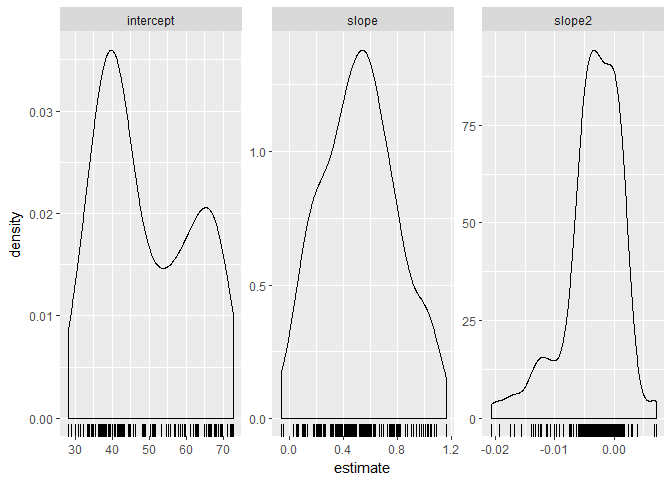
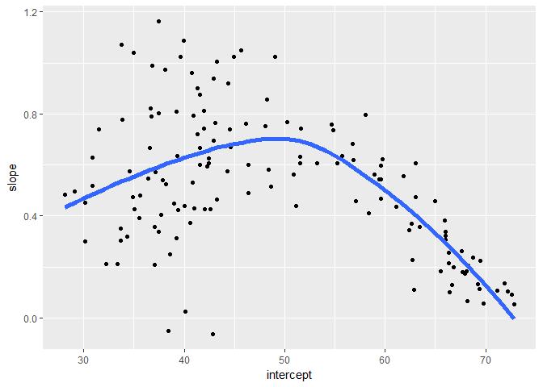
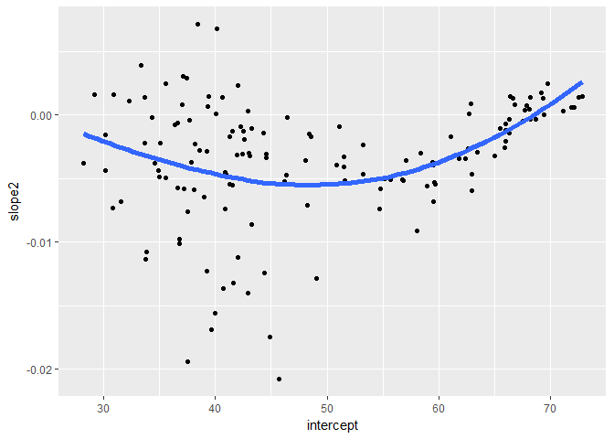

hw06
================
Victoria Michalowski
November 9, 2017

2. Writing Functions
--------------------

starting point: the linear regression function example.
-------------------------------------------------------

First, load the gapminde data.

``` r
library(gapminder)
```

    ## Warning: package 'gapminder' was built under R version 3.3.3

``` r
library(tidyverse)
```

    ## Warning: package 'tidyverse' was built under R version 3.3.3

    ## Loading tidyverse: ggplot2
    ## Loading tidyverse: tibble
    ## Loading tidyverse: tidyr
    ## Loading tidyverse: readr
    ## Loading tidyverse: purrr
    ## Loading tidyverse: dplyr

    ## Warning: package 'ggplot2' was built under R version 3.3.2

    ## Warning: package 'tidyr' was built under R version 3.3.3

    ## Warning: package 'readr' was built under R version 3.3.2

    ## Warning: package 'purrr' was built under R version 3.3.3

    ## Warning: package 'dplyr' was built under R version 3.3.3

    ## Conflicts with tidy packages ----------------------------------------------

    ## filter(): dplyr, stats
    ## lag():    dplyr, stats

Extract data for one country.

``` r
j_country <- "Finland" #pick a country, but do not hard wire
(j_dat <- gapminder %>% 
    filter(country == j_country))
```

    ## # A tibble: 12 × 6
    ##    country continent  year lifeExp     pop gdpPercap
    ##     <fctr>    <fctr> <int>   <dbl>   <int>     <dbl>
    ## 1  Finland    Europe  1952  66.550 4090500  6424.519
    ## 2  Finland    Europe  1957  67.490 4324000  7545.415
    ## 3  Finland    Europe  1962  68.750 4491443  9371.843
    ## 4  Finland    Europe  1967  69.830 4605744 10921.636
    ## 5  Finland    Europe  1972  70.870 4639657 14358.876
    ## 6  Finland    Europe  1977  72.520 4738902 15605.423
    ## 7  Finland    Europe  1982  74.550 4826933 18533.158
    ## 8  Finland    Europe  1987  74.830 4931729 21141.012
    ## 9  Finland    Europe  1992  75.700 5041039 20647.165
    ## 10 Finland    Europe  1997  77.130 5134406 23723.950
    ## 11 Finland    Europe  2002  78.370 5193039 28204.591
    ## 12 Finland    Europe  2007  79.313 5238460 33207.084

Plot the data.

``` r
p <- ggplot(j_dat, aes(x = year, y = lifeExp))
p + geom_point() + geom_smooth(method = "lm", se = FALSE)
```


Fit the linear regression.

``` r
j_fit <- lm(lifeExp ~ year, j_dat)
coef(j_fit)
```

    ##  (Intercept)         year 
    ## -397.9809669    0.2379252

The intercept here suggests that life expectancy in Finland was almost minus 400 years at year 0 A.D. This doesn't make sense, so reparametrization is called for. It makes more sense to have the intercept correspond to life expectancy in 1952, the first measurement point in the gapminder dataset.

``` r
j_fit <- lm(lifeExp ~ I(year - 1952), j_dat) #I() function inhibits interpretation/conversion of objects
coef(j_fit)
```

    ##    (Intercept) I(year - 1952) 
    ##     66.4489744      0.2379252

This intercept makes more sense, and by eyeballing the plot above, we can tell that it's in line with the data and more interpretable.

turn this working code into a function.
---------------------------------------

Drop the working code into the basic definition of a function.

``` r
le_linear_fit <- function(dat) {
  the_fit <- lm(lifeExp ~ I(year - 1952), dat)
  coef(the_fit)
}
le_linear_fit(j_dat)
```

    ##    (Intercept) I(year - 1952) 
    ##     66.4489744      0.2379252

Notice we get the same result as before. The names on this return value are not intuitive - fix names next to make them interpretable.

``` r
le_linear_fit <- function(dat) {
  the_fit <- lm(lifeExp ~ I(year - 1952), dat)
  setNames(coef(the_fit), c("intercept", "slope"))
}
le_linear_fit(j_dat)
```

    ##  intercept      slope 
    ## 66.4489744  0.2379252

rotate through other examples in a clean workspace.
---------------------------------------------------

It's a good idea to test your function on other data during development. The most common catch is accidental hard-wires of examples in the function.

``` r
j_country <- "Brazil"
(j_dat <- gapminder %>% 
    filter(country == j_country))
```

    ## # A tibble: 12 × 6
    ##    country continent  year lifeExp       pop gdpPercap
    ##     <fctr>    <fctr> <int>   <dbl>     <int>     <dbl>
    ## 1   Brazil  Americas  1952  50.917  56602560  2108.944
    ## 2   Brazil  Americas  1957  53.285  65551171  2487.366
    ## 3   Brazil  Americas  1962  55.665  76039390  3336.586
    ## 4   Brazil  Americas  1967  57.632  88049823  3429.864
    ## 5   Brazil  Americas  1972  59.504 100840058  4985.711
    ## 6   Brazil  Americas  1977  61.489 114313951  6660.119
    ## 7   Brazil  Americas  1982  63.336 128962939  7030.836
    ## 8   Brazil  Americas  1987  65.205 142938076  7807.096
    ## 9   Brazil  Americas  1992  67.057 155975974  6950.283
    ## 10  Brazil  Americas  1997  69.388 168546719  7957.981
    ## 11  Brazil  Americas  2002  71.006 179914212  8131.213
    ## 12  Brazil  Americas  2007  72.390 190010647  9065.801

``` r
p1 <- ggplot(j_dat, aes(x = year, y = lifeExp))
p1 + geom_point() + geom_smooth(method = "lm", se = FALSE)
```


``` r
le_linear_fit(j_dat)
```

    ##  intercept      slope 
    ## 51.5120385  0.3900895

The regression results seem to match up with the visual line.

Next, I cleaned out my workspace, re-ran the minimum amount of code, and re-tested my function. This will help avoid accidentally relying on objects that were left over from development, but are not actually defined in the function code.

``` r
rm(list = ls())

le_linear_fit <- function(dat) {
  the_fit <- lm(lifeExp ~ I(year - 1952), dat)
  setNames(coef(the_fit), c("intercept", "slope"))
}
le_linear_fit(gapminder %>% 
                filter(country == "Sweden"))
```

    ##  intercept      slope 
    ## 71.6050000  0.1662545

generalize: quadratic regression.
---------------------------------

Include a squared term to extend the example from a linear regression to a quadratic regression.

``` r
le_quadratic_fit <- function(dat) {
  the_fit2 <- lm(lifeExp ~ I(year - 1952) + I((year - 1952)^2), dat)
  setNames(coef(the_fit2), c("intercept", "Year", "Year2"))
}

le_quadratic_fit(gapminder %>% 
                   filter(country == "Sweden"))
```

    ##    intercept         Year        Year2 
    ## 7.186599e+01 1.349359e-01 5.694306e-04

6. Work with a nested data frame
--------------------------------

nest the data by country and continent.
---------------------------------------

Nesting is an extension of grouping. Unlike grouping though, the collapse to a single row per group happens right away. The non-grouping variables are packaged into group-specific data frames that are held in a list-column. Then the computation to the components of this list gets applied.

First, group, and then nest. Group by country and continent.

``` r
(gap_nested <- gapminder %>% 
   group_by(continent, country) %>% 
   nest())
```

    ## # A tibble: 142 × 3
    ##    continent     country              data
    ##       <fctr>      <fctr>            <list>
    ## 1       Asia Afghanistan <tibble [12 × 4]>
    ## 2     Europe     Albania <tibble [12 × 4]>
    ## 3     Africa     Algeria <tibble [12 × 4]>
    ## 4     Africa      Angola <tibble [12 × 4]>
    ## 5   Americas   Argentina <tibble [12 × 4]>
    ## 6    Oceania   Australia <tibble [12 × 4]>
    ## 7     Europe     Austria <tibble [12 × 4]>
    ## 8       Asia     Bahrain <tibble [12 × 4]>
    ## 9       Asia  Bangladesh <tibble [12 × 4]>
    ## 10    Europe     Belgium <tibble [12 × 4]>
    ## # ... with 132 more rows

Note: - we collapsed to 142 rows, with one row per country - continent and country remain - there is a new "data"" variable, and this variable is a list: a list-column, in which the non-grouping variables are held.

Let's try to inspect the new list-column.

``` r
gap_nested[[1, "data"]]
```

    ## # A tibble: 12 × 4
    ##     year lifeExp      pop gdpPercap
    ##    <int>   <dbl>    <int>     <dbl>
    ## 1   1952  28.801  8425333  779.4453
    ## 2   1957  30.332  9240934  820.8530
    ## 3   1962  31.997 10267083  853.1007
    ## 4   1967  34.020 11537966  836.1971
    ## 5   1972  36.088 13079460  739.9811
    ## 6   1977  38.438 14880372  786.1134
    ## 7   1982  39.854 12881816  978.0114
    ## 8   1987  40.822 13867957  852.3959
    ## 9   1992  41.674 16317921  649.3414
    ## 10  1997  41.763 22227415  635.3414
    ## 11  2002  42.129 25268405  726.7341
    ## 12  2007  43.828 31889923  974.5803

``` r
#or

gap_nested[["data"]][[1]]
```

    ## # A tibble: 12 × 4
    ##     year lifeExp      pop gdpPercap
    ##    <int>   <dbl>    <int>     <dbl>
    ## 1   1952  28.801  8425333  779.4453
    ## 2   1957  30.332  9240934  820.8530
    ## 3   1962  31.997 10267083  853.1007
    ## 4   1967  34.020 11537966  836.1971
    ## 5   1972  36.088 13079460  739.9811
    ## 6   1977  38.438 14880372  786.1134
    ## 7   1982  39.854 12881816  978.0114
    ## 8   1987  40.822 13867957  852.3959
    ## 9   1992  41.674 16317921  649.3414
    ## 10  1997  41.763 22227415  635.3414
    ## 11  2002  42.129 25268405  726.7341
    ## 12  2007  43.828 31889923  974.5803

``` r
#or

gap_nested$data[[1]]
```

    ## # A tibble: 12 × 4
    ##     year lifeExp      pop gdpPercap
    ##    <int>   <dbl>    <int>     <dbl>
    ## 1   1952  28.801  8425333  779.4453
    ## 2   1957  30.332  9240934  820.8530
    ## 3   1962  31.997 10267083  853.1007
    ## 4   1967  34.020 11537966  836.1971
    ## 5   1972  36.088 13079460  739.9811
    ## 6   1977  38.438 14880372  786.1134
    ## 7   1982  39.854 12881816  978.0114
    ## 8   1987  40.822 13867957  852.3959
    ## 9   1992  41.674 16317921  649.3414
    ## 10  1997  41.763 22227415  635.3414
    ## 11  2002  42.129 25268405  726.7341
    ## 12  2007  43.828 31889923  974.5803

apply a function.
-----------------

Let's try to iterate over the elements of gap\_nested$data, using purrr::map().

First, fit a model to the data from Sweden.

``` r
(fit <- lm(lifeExp ~ I(year - 1952), data = gap_nested[[123,"data"]]))
```

    ## 
    ## Call:
    ## lm(formula = lifeExp ~ I(year - 1952), data = gap_nested[[123, 
    ##     "data"]])
    ## 
    ## Coefficients:
    ##    (Intercept)  I(year - 1952)  
    ##        71.6050          0.1663

Capture that logic in a function, and test whether it returns that same results for Sweden as above.

``` r
le_vs_yr <- function(df) {
  quad_fit <- lm(lifeExp ~ I(year - 1952) + I((year - 1952)^2), data = df)
  summary(quad_fit)
}
le_vs_yr(gap_nested[[123, "data"]])
```

    ## 
    ## Call:
    ## lm(formula = lifeExp ~ I(year - 1952) + I((year - 1952)^2), data = df)
    ## 
    ## Residuals:
    ##      Min       1Q   Median       3Q      Max 
    ## -0.15528 -0.07843 -0.01053  0.02716  0.29880 
    ## 
    ## Coefficients:
    ##                     Estimate Std. Error t value Pr(>|t|)    
    ## (Intercept)        7.187e+01  1.040e-01 691.173  < 2e-16 ***
    ## I(year - 1952)     1.349e-01  8.789e-03  15.353 9.22e-08 ***
    ## I((year - 1952)^2) 5.694e-04  1.540e-04   3.698  0.00493 ** 
    ## ---
    ## Signif. codes:  0 '***' 0.001 '**' 0.01 '*' 0.05 '.' 0.1 ' ' 1
    ## 
    ## Residual standard error: 0.1406 on 9 degrees of freedom
    ## Multiple R-squared:  0.9982, Adjusted R-squared:  0.9978 
    ## F-statistic:  2505 on 2 and 9 DF,  p-value: 4.376e-13

use the broom package to get information out of my quadratic model.
-------------------------------------------------------------------

``` r
library(broom)
```

    ## Warning: package 'broom' was built under R version 3.3.3

``` r
le_vs_yr1 <- function(df) {
  quad_fit <- lm(lifeExp ~ I(year - 1952) + I((year - 1952)^2), data = df)
  tidy(quad_fit)
}
le_vs_yr(gap_nested[[123, "data"]])
```

    ## 
    ## Call:
    ## lm(formula = lifeExp ~ I(year - 1952) + I((year - 1952)^2), data = df)
    ## 
    ## Residuals:
    ##      Min       1Q   Median       3Q      Max 
    ## -0.15528 -0.07843 -0.01053  0.02716  0.29880 
    ## 
    ## Coefficients:
    ##                     Estimate Std. Error t value Pr(>|t|)    
    ## (Intercept)        7.187e+01  1.040e-01 691.173  < 2e-16 ***
    ## I(year - 1952)     1.349e-01  8.789e-03  15.353 9.22e-08 ***
    ## I((year - 1952)^2) 5.694e-04  1.540e-04   3.698  0.00493 ** 
    ## ---
    ## Signif. codes:  0 '***' 0.001 '**' 0.01 '*' 0.05 '.' 0.1 ' ' 1
    ## 
    ## Residual standard error: 0.1406 on 9 degrees of freedom
    ## Multiple R-squared:  0.9982, Adjusted R-squared:  0.9978 
    ## F-statistic:  2505 on 2 and 9 DF,  p-value: 4.376e-13

Now we have a data.frame representation, with the row names moved into the column called term, and the column names are simple and consistent (can access using $).

What if you are interested in the fitted values and residuals for each of the original points in the regression?

Use augment, which augments the original data with information from the model.

``` r
le_vs_yr2 <- function(df) {
  quad_fit <- lm(lifeExp ~ I(year - 1952) + I((year - 1952)^2), data = df)
  head(augment(quad_fit))
}
le_vs_yr(gap_nested[[123, "data"]])
```

    ## 
    ## Call:
    ## lm(formula = lifeExp ~ I(year - 1952) + I((year - 1952)^2), data = df)
    ## 
    ## Residuals:
    ##      Min       1Q   Median       3Q      Max 
    ## -0.15528 -0.07843 -0.01053  0.02716  0.29880 
    ## 
    ## Coefficients:
    ##                     Estimate Std. Error t value Pr(>|t|)    
    ## (Intercept)        7.187e+01  1.040e-01 691.173  < 2e-16 ***
    ## I(year - 1952)     1.349e-01  8.789e-03  15.353 9.22e-08 ***
    ## I((year - 1952)^2) 5.694e-04  1.540e-04   3.698  0.00493 ** 
    ## ---
    ## Signif. codes:  0 '***' 0.001 '**' 0.01 '*' 0.05 '.' 0.1 ' ' 1
    ## 
    ## Residual standard error: 0.1406 on 9 degrees of freedom
    ## Multiple R-squared:  0.9982, Adjusted R-squared:  0.9978 
    ## F-statistic:  2505 on 2 and 9 DF,  p-value: 4.376e-13

Each new column (e.g. .fitted, .se.fit, etc.) begins with a . to avoid overwritting original columns.

Access summary statistics (such as R^2 and the F-statistic) with the glance function.

``` r
le_vs_yr3 <- function(df) {
  quad_fit <- lm(lifeExp ~ I(year - 1952) + I((year - 1952)^2), data = df)
  glance(quad_fit)
}
le_vs_yr(gap_nested[[123, "data"]])
```

    ## 
    ## Call:
    ## lm(formula = lifeExp ~ I(year - 1952) + I((year - 1952)^2), data = df)
    ## 
    ## Residuals:
    ##      Min       1Q   Median       3Q      Max 
    ## -0.15528 -0.07843 -0.01053  0.02716  0.29880 
    ## 
    ## Coefficients:
    ##                     Estimate Std. Error t value Pr(>|t|)    
    ## (Intercept)        7.187e+01  1.040e-01 691.173  < 2e-16 ***
    ## I(year - 1952)     1.349e-01  8.789e-03  15.353 9.22e-08 ***
    ## I((year - 1952)^2) 5.694e-04  1.540e-04   3.698  0.00493 ** 
    ## ---
    ## Signif. codes:  0 '***' 0.001 '**' 0.01 '*' 0.05 '.' 0.1 ' ' 1
    ## 
    ## Residual standard error: 0.1406 on 9 degrees of freedom
    ## Multiple R-squared:  0.9982, Adjusted R-squared:  0.9978 
    ## F-statistic:  2505 on 2 and 9 DF,  p-value: 4.376e-13

Use purrr:map() to apply the fitting function le\_vs\_yr() to the first 2 elements of gap\_nested$data.

``` r
fits <- map(gap_nested$data[1:2], le_vs_yr)
fits
```

    ## [[1]]
    ## 
    ## Call:
    ## lm(formula = lifeExp ~ I(year - 1952) + I((year - 1952)^2), data = df)
    ## 
    ## Residuals:
    ##      Min       1Q   Median       3Q      Max 
    ## -0.75900 -0.51487  0.02653  0.51654  0.62231 
    ## 
    ## Coefficients:
    ##                      Estimate Std. Error t value Pr(>|t|)    
    ## (Intercept)        28.1786868  0.4330130  65.076 2.41e-13 ***
    ## I(year - 1952)      0.4827616  0.0366013  13.190 3.43e-07 ***
    ## I((year - 1952)^2) -0.0037715  0.0006412  -5.882 0.000234 ***
    ## ---
    ## Signif. codes:  0 '***' 0.001 '**' 0.01 '*' 0.05 '.' 0.1 ' ' 1
    ## 
    ## Residual standard error: 0.5856 on 9 degrees of freedom
    ## Multiple R-squared:  0.9892, Adjusted R-squared:  0.9868 
    ## F-statistic: 412.4 on 2 and 9 DF,  p-value: 1.41e-09
    ## 
    ## 
    ## [[2]]
    ## 
    ## Call:
    ## lm(formula = lifeExp ~ I(year - 1952) + I((year - 1952)^2), data = df)
    ## 
    ## Residuals:
    ##     Min      1Q  Median      3Q     Max 
    ## -1.7698 -0.7311 -0.1870  0.8663  2.2872 
    ## 
    ## Coefficients:
    ##                     Estimate Std. Error t value Pr(>|t|)    
    ## (Intercept)        56.853135   1.013452  56.099 9.15e-13 ***
    ## I(year - 1952)      0.619802   0.085664   7.235 4.89e-05 ***
    ## I((year - 1952)^2) -0.005184   0.001501  -3.454  0.00723 ** 
    ## ---
    ## Signif. codes:  0 '***' 0.001 '**' 0.01 '*' 0.05 '.' 0.1 ' ' 1
    ## 
    ## Residual standard error: 1.371 on 9 degrees of freedom
    ## Multiple R-squared:  0.9616, Adjusted R-squared:  0.953 
    ## F-statistic: 112.5 on 2 and 9 DF,  p-value: 4.285e-07

To scale this up to all countries, use map() inside of mutate() to store the models inside gap\_nested, in another list-column.

``` r
(gap_nested <- gap_nested %>% 
   mutate(fit = map(data, le_vs_yr)))
```

    ## # A tibble: 142 × 4
    ##    continent     country              data              fit
    ##       <fctr>      <fctr>            <list>           <list>
    ## 1       Asia Afghanistan <tibble [12 × 4]> <S3: summary.lm>
    ## 2     Europe     Albania <tibble [12 × 4]> <S3: summary.lm>
    ## 3     Africa     Algeria <tibble [12 × 4]> <S3: summary.lm>
    ## 4     Africa      Angola <tibble [12 × 4]> <S3: summary.lm>
    ## 5   Americas   Argentina <tibble [12 × 4]> <S3: summary.lm>
    ## 6    Oceania   Australia <tibble [12 × 4]> <S3: summary.lm>
    ## 7     Europe     Austria <tibble [12 × 4]> <S3: summary.lm>
    ## 8       Asia     Bahrain <tibble [12 × 4]> <S3: summary.lm>
    ## 9       Asia  Bangladesh <tibble [12 × 4]> <S3: summary.lm>
    ## 10    Europe     Belgium <tibble [12 × 4]> <S3: summary.lm>
    ## # ... with 132 more rows

Now we have a new list-column, the fit variable, which holds 142 fitted models.

We want to pull information out of these complicated objects into something simpler such as a tibble. Let's get back to the broom function to take lm() fit and turn it into a useful tibble.

``` r
tidy(gap_nested$fit[[1]])
```

    ##                 term     estimate    std.error statistic      p.value
    ## 1        (Intercept) 28.178686813 0.4330129763 65.075848 2.411684e-13
    ## 2     I(year - 1952)  0.482761638 0.0366012911 13.189743 3.428452e-07
    ## 3 I((year - 1952)^2) -0.003771508 0.0006412076 -5.881884 2.342789e-04

The result is a three row data frame, one row for the intercept, another for the first slope term, and another for the squared slope term.

Apply tidy() to the model for each country with the same map() inside mutate() approach as above.

``` r
(gap_nested <- gap_nested %>% 
   mutate(tidy = map(fit, tidy)))
```

    ## # A tibble: 142 × 5
    ##    continent     country              data              fit
    ##       <fctr>      <fctr>            <list>           <list>
    ## 1       Asia Afghanistan <tibble [12 × 4]> <S3: summary.lm>
    ## 2     Europe     Albania <tibble [12 × 4]> <S3: summary.lm>
    ## 3     Africa     Algeria <tibble [12 × 4]> <S3: summary.lm>
    ## 4     Africa      Angola <tibble [12 × 4]> <S3: summary.lm>
    ## 5   Americas   Argentina <tibble [12 × 4]> <S3: summary.lm>
    ## 6    Oceania   Australia <tibble [12 × 4]> <S3: summary.lm>
    ## 7     Europe     Austria <tibble [12 × 4]> <S3: summary.lm>
    ## 8       Asia     Bahrain <tibble [12 × 4]> <S3: summary.lm>
    ## 9       Asia  Bangladesh <tibble [12 × 4]> <S3: summary.lm>
    ## 10    Europe     Belgium <tibble [12 × 4]> <S3: summary.lm>
    ## # ... with 132 more rows, and 1 more variables: tidy <list>

Lastly, we can simplify back to a normal tibble, using unnest() to complete the circle.

``` r
(gap_coefs <- gap_nested %>% 
select(continent, country, tidy) %>% 
unnest(tidy))
```

    ## # A tibble: 426 × 7
    ##    continent     country               term     estimate    std.error
    ##       <fctr>      <fctr>              <chr>        <dbl>        <dbl>
    ## 1       Asia Afghanistan        (Intercept) 28.178686813 0.4330129763
    ## 2       Asia Afghanistan     I(year - 1952)  0.482761638 0.0366012911
    ## 3       Asia Afghanistan I((year - 1952)^2) -0.003771508 0.0006412076
    ## 4     Europe     Albania        (Intercept) 56.853134615 1.0134515113
    ## 5     Europe     Albania     I(year - 1952)  0.619802448 0.0856640234
    ## 6     Europe     Albania I((year - 1952)^2) -0.005183986 0.0015007236
    ## 7     Africa     Algeria        (Intercept) 41.942236264 0.7537233613
    ## 8     Africa     Algeria     I(year - 1952)  0.741208292 0.0637099802
    ## 9     Africa     Algeria I((year - 1952)^2) -0.003125974 0.0011161170
    ## 10    Africa      Angola        (Intercept) 30.117670330 0.4785540412
    ## # ... with 416 more rows, and 2 more variables: statistic <dbl>,
    ## #   p.value <dbl>

Now we have an intercept, slope, and squared slope term for each country.

Putting that all together into one spot:

``` r
gap_nested <- gapminder %>%
  group_by(continent, country) %>% 
  nest()

le_vs_yr <- function (df) {
  lm(lifeExp ~ I(year - 1952) + I((year - 1952)^2), data = df)
}

gap_coefs <- gap_nested %>% 
  mutate(fit = map(data, le_vs_yr),
         tidy = map(fit, tidy)) %>% 
  select(continent, country, tidy) %>% 
  unnest(tidy)
```

explore the estimated coefficients.
-----------------------------------

``` r
(gap_coefs <- gap_coefs %>%
   mutate(term = recode(term,
                        `(Intercept)` = "intercept",
                        `I(year - 1952)` = "slope",
                        `I((year - 1952)^2)` = "slope2")))
```

    ## # A tibble: 426 × 7
    ##    continent     country      term     estimate    std.error statistic
    ##       <fctr>      <fctr>     <chr>        <dbl>        <dbl>     <dbl>
    ## 1       Asia Afghanistan intercept 28.178686813 0.4330129763 65.075848
    ## 2       Asia Afghanistan     slope  0.482761638 0.0366012911 13.189743
    ## 3       Asia Afghanistan    slope2 -0.003771508 0.0006412076 -5.881884
    ## 4     Europe     Albania intercept 56.853134615 1.0134515113 56.098525
    ## 5     Europe     Albania     slope  0.619802448 0.0856640234  7.235271
    ## 6     Europe     Albania    slope2 -0.005183986 0.0015007236 -3.454324
    ## 7     Africa     Algeria intercept 41.942236264 0.7537233613 55.646725
    ## 8     Africa     Algeria     slope  0.741208292 0.0637099802 11.634100
    ## 9     Africa     Algeria    slope2 -0.003125974 0.0011161170 -2.800758
    ## 10    Africa      Angola intercept 30.117670330 0.4785540412 62.934732
    ## # ... with 416 more rows, and 1 more variables: p.value <dbl>

Next, I wanted to try out gap\_ests, a reshaped version of estimates, for numerical summarization and visualization.

``` r
(gap_ests <- gap_coefs %>% 
   select(continent:estimate) %>% 
   spread(key = term, value = estimate))
```

    ## # A tibble: 142 × 5
    ##    continent                  country intercept     slope       slope2
    ## *     <fctr>                   <fctr>     <dbl>     <dbl>        <dbl>
    ## 1     Africa                  Algeria  41.94224 0.7412083 -0.003125974
    ## 2     Africa                   Angola  30.11767 0.4504179 -0.004383237
    ## 3     Africa                    Benin  37.86994 0.5404620 -0.003749620
    ## 4     Africa                 Botswana  44.91197 1.0227257 -0.017491948
    ## 5     Africa             Burkina Faso  31.54945 0.7402045 -0.006840539
    ## 6     Africa                  Burundi  39.26621 0.3116255 -0.002863477
    ## 7     Africa                 Cameroon  36.75949 0.7889436 -0.009796304
    ## 8     Africa Central African Republic  33.86187 0.7776226 -0.010794855
    ## 9     Africa                     Chad  37.15506 0.5717611 -0.005791219
    ## 10    Africa                  Comoros  40.64126 0.3729596  0.001407842
    ## # ... with 132 more rows

To take a look at the numerical summaries of the above:

``` r
gap_ests %>% 
  select(intercept, slope, slope2) %>% 
  summary()
```

    ##    intercept         slope              slope2         
    ##  Min.   :28.18   Min.   :-0.06327   Min.   :-0.020779  
    ##  1st Qu.:38.45   1st Qu.: 0.32038   1st Qu.:-0.005415  
    ##  Median :44.48   Median : 0.52106   Median :-0.003022  
    ##  Mean   :48.92   Mean   : 0.51742   Mean   :-0.003482  
    ##  3rd Qu.:60.72   3rd Qu.: 0.71379   3rd Qu.:-0.000184  
    ##  Max.   :72.88   Max.   : 1.16222   Max.   : 0.007128

We can see that the summaries seem reasonable.

Lastly, we can also look at the full distribution visually, using ggplot:

``` r
ggplot(gap_coefs, aes(x = estimate)) +
  geom_density() + 
  geom_rug() + 
  facet_wrap(~ term, scales = "free")
```



``` r
ggplot(gap_ests, aes(x = intercept, y = slope)) +
  geom_point() +
  geom_smooth(se=FALSE, lwd = 2)
```

    ## `geom_smooth()` using method = 'loess'



``` r
ggplot(gap_ests, aes(x = intercept, y = slope2)) +
  geom_point() +
  geom_smooth(se=FALSE, lwd = 2)
```

    ## `geom_smooth()` using method = 'loess'


