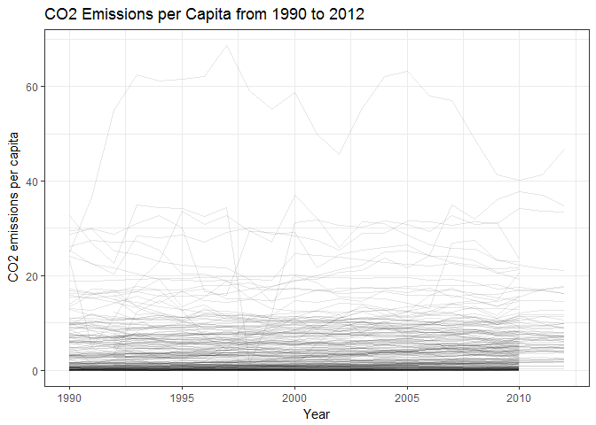
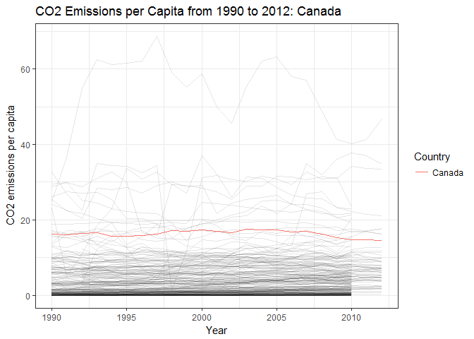
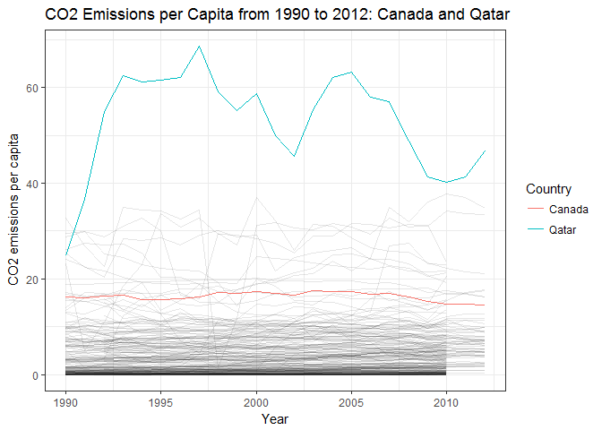

hw07
================
Victoria Michalowski
November 13, 2017

For this assignment, I was having trouble downloading the gapminder data from the detailed instructions of the assignment, so I went to the gapminder website (<http://www.gapminder.org/data/>) looking for the original source, and found that they have many different kinds of worldwide data sets. I decided to choose one on CO2 emissions across different countries in the world.

Download the Data
=================

The first step is to download the raw data, which I had already uploaded to my github repo anyways.

``` r
download.file("https://raw.githubusercontent.com/vmichalowski/STAT545-hw-Michalowski-Victoria/master/hw07%20-%20automating%20pipelines/CO2_emissions-CDIAC.csv", destfile="CO2_emissions-CDIAC.csv")
```

Next, I wanted to bring the data in as data frame. I found that the years were being read in with an "X" in front of the year for some reason, but using the check.names = FALSE argument fixed this so that the column names were read in as I wanted them to be.

``` r
CO2 <- read.csv("CO2_emissions-CDIAC.csv", header = TRUE, check.names = FALSE, na="NA")
head(CO2)
```

    ##                 Country 1751 1755 1762 1763 1764 1765 1766 1767 1768 1769
    ## 1              Abkhazia   NA   NA   NA   NA   NA   NA   NA   NA   NA   NA
    ## 2           Afghanistan   NA   NA   NA   NA   NA   NA   NA   NA   NA   NA
    ## 3 Akrotiri and Dhekelia   NA   NA   NA   NA   NA   NA   NA   NA   NA   NA
    ## 4               Albania   NA   NA   NA   NA   NA   NA   NA   NA   NA   NA
    ## 5               Algeria   NA   NA   NA   NA   NA   NA   NA   NA   NA   NA
    ## 6        American Samoa   NA   NA   NA   NA   NA   NA   NA   NA   NA   NA
    ##   1770 1771 1772 1773 1774 1775 1776 1777 1778 1779 1780 1781 1782 1783
    ## 1   NA   NA   NA   NA   NA   NA   NA   NA   NA   NA   NA   NA   NA   NA
    ## 2   NA   NA   NA   NA   NA   NA   NA   NA   NA   NA   NA   NA   NA   NA
    ## 3   NA   NA   NA   NA   NA   NA   NA   NA   NA   NA   NA   NA   NA   NA
    ## 4   NA   NA   NA   NA   NA   NA   NA   NA   NA   NA   NA   NA   NA   NA
    ## 5   NA   NA   NA   NA   NA   NA   NA   NA   NA   NA   NA   NA   NA   NA
    ## 6   NA   NA   NA   NA   NA   NA   NA   NA   NA   NA   NA   NA   NA   NA
    ##   1784 1785 1786 1787 1788 1789 1790 1791 1792 1793 1794 1795 1796 1797
    ## 1   NA   NA   NA   NA   NA   NA   NA   NA   NA   NA   NA   NA   NA   NA
    ## 2   NA   NA   NA   NA   NA   NA   NA   NA   NA   NA   NA   NA   NA   NA
    ## 3   NA   NA   NA   NA   NA   NA   NA   NA   NA   NA   NA   NA   NA   NA
    ## 4   NA   NA   NA   NA   NA   NA   NA   NA   NA   NA   NA   NA   NA   NA
    ## 5   NA   NA   NA   NA   NA   NA   NA   NA   NA   NA   NA   NA   NA   NA
    ## 6   NA   NA   NA   NA   NA   NA   NA   NA   NA   NA   NA   NA   NA   NA
    ##   1798 1799 1800 1801 1802 1803 1804 1805 1806 1807 1808 1809 1810 1811
    ## 1   NA   NA   NA   NA   NA   NA   NA   NA   NA   NA   NA   NA   NA   NA
    ## 2   NA   NA   NA   NA   NA   NA   NA   NA   NA   NA   NA   NA   NA   NA
    ## 3   NA   NA   NA   NA   NA   NA   NA   NA   NA   NA   NA   NA   NA   NA
    ## 4   NA   NA   NA   NA   NA   NA   NA   NA   NA   NA   NA   NA   NA   NA
    ## 5   NA   NA   NA   NA   NA   NA   NA   NA   NA   NA   NA   NA   NA   NA
    ## 6   NA   NA   NA   NA   NA   NA   NA   NA   NA   NA   NA   NA   NA   NA
    ##   1812 1813 1814 1815 1816 1817 1818 1819 1820 1821 1822 1823 1824 1825
    ## 1   NA   NA   NA   NA   NA   NA   NA   NA   NA   NA   NA   NA   NA   NA
    ## 2   NA   NA   NA   NA   NA   NA   NA   NA   NA   NA   NA   NA   NA   NA
    ## 3   NA   NA   NA   NA   NA   NA   NA   NA   NA   NA   NA   NA   NA   NA
    ## 4   NA   NA   NA   NA   NA   NA   NA   NA   NA   NA   NA   NA   NA   NA
    ## 5   NA   NA   NA   NA   NA   NA   NA   NA   NA   NA   NA   NA   NA   NA
    ## 6   NA   NA   NA   NA   NA   NA   NA   NA   NA   NA   NA   NA   NA   NA
    ##   1826 1827 1828 1829 1830 1831 1832 1833 1834 1835 1836 1837 1838 1839
    ## 1   NA   NA   NA   NA   NA   NA   NA   NA   NA   NA   NA   NA   NA   NA
    ## 2   NA   NA   NA   NA   NA   NA   NA   NA   NA   NA   NA   NA   NA   NA
    ## 3   NA   NA   NA   NA   NA   NA   NA   NA   NA   NA   NA   NA   NA   NA
    ## 4   NA   NA   NA   NA   NA   NA   NA   NA   NA   NA   NA   NA   NA   NA
    ## 5   NA   NA   NA   NA   NA   NA   NA   NA   NA   NA   NA   NA   NA   NA
    ## 6   NA   NA   NA   NA   NA   NA   NA   NA   NA   NA   NA   NA   NA   NA
    ##   1840 1841 1842 1843 1844 1845 1846 1847 1848 1849 1850 1851 1852 1853
    ## 1   NA   NA   NA   NA   NA   NA   NA   NA   NA   NA   NA   NA   NA   NA
    ## 2   NA   NA   NA   NA   NA   NA   NA   NA   NA   NA   NA   NA   NA   NA
    ## 3   NA   NA   NA   NA   NA   NA   NA   NA   NA   NA   NA   NA   NA   NA
    ## 4   NA   NA   NA   NA   NA   NA   NA   NA   NA   NA   NA   NA   NA   NA
    ## 5   NA   NA   NA   NA   NA   NA   NA   NA   NA   NA   NA   NA   NA   NA
    ## 6   NA   NA   NA   NA   NA   NA   NA   NA   NA   NA   NA   NA   NA   NA
    ##   1854 1855 1856 1857 1858 1859 1860 1861 1862 1863 1864 1865 1866 1867
    ## 1   NA   NA   NA   NA   NA   NA   NA   NA   NA   NA   NA   NA   NA   NA
    ## 2   NA   NA   NA   NA   NA   NA   NA   NA   NA   NA   NA   NA   NA   NA
    ## 3   NA   NA   NA   NA   NA   NA   NA   NA   NA   NA   NA   NA   NA   NA
    ## 4   NA   NA   NA   NA   NA   NA   NA   NA   NA   NA   NA   NA   NA   NA
    ## 5   NA   NA   NA   NA   NA   NA   NA   NA   NA   NA   NA   NA   NA   NA
    ## 6   NA   NA   NA   NA   NA   NA   NA   NA   NA   NA   NA   NA   NA   NA
    ##   1868 1869 1870 1871 1872 1873 1874 1875 1876 1877 1878 1879 1880 1881
    ## 1   NA   NA   NA   NA   NA   NA   NA   NA   NA   NA   NA   NA   NA   NA
    ## 2   NA   NA   NA   NA   NA   NA   NA   NA   NA   NA   NA   NA   NA   NA
    ## 3   NA   NA   NA   NA   NA   NA   NA   NA   NA   NA   NA   NA   NA   NA
    ## 4   NA   NA   NA   NA   NA   NA   NA   NA   NA   NA   NA   NA   NA   NA
    ## 5   NA   NA   NA   NA   NA   NA   NA   NA   NA   NA   NA   NA   NA   NA
    ## 6   NA   NA   NA   NA   NA   NA   NA   NA   NA   NA   NA   NA   NA   NA
    ##   1882 1883 1884 1885 1886 1887 1888 1889 1890 1891 1892 1893 1894 1895
    ## 1   NA   NA   NA   NA   NA   NA   NA   NA   NA   NA   NA   NA   NA   NA
    ## 2   NA   NA   NA   NA   NA   NA   NA   NA   NA   NA   NA   NA   NA   NA
    ## 3   NA   NA   NA   NA   NA   NA   NA   NA   NA   NA   NA   NA   NA   NA
    ## 4   NA   NA   NA   NA   NA   NA   NA   NA   NA   NA   NA   NA   NA   NA
    ## 5   NA   NA   NA   NA   NA   NA   NA   NA   NA   NA   NA   NA   NA   NA
    ## 6   NA   NA   NA   NA   NA   NA   NA   NA   NA   NA   NA   NA   NA   NA
    ##   1896 1897 1898 1899 1900 1901 1902 1903 1904 1905 1906 1907 1908 1909
    ## 1   NA   NA   NA   NA   NA   NA   NA   NA   NA   NA   NA   NA   NA   NA
    ## 2   NA   NA   NA   NA   NA   NA   NA   NA   NA   NA   NA   NA   NA   NA
    ## 3   NA   NA   NA   NA   NA   NA   NA   NA   NA   NA   NA   NA   NA   NA
    ## 4   NA   NA   NA   NA   NA   NA   NA   NA   NA   NA   NA   NA   NA   NA
    ## 5   NA   NA   NA   NA    0    0    0    0    0    0   NA   NA   NA   NA
    ## 6   NA   NA   NA   NA   NA   NA   NA   NA   NA   NA   NA   NA   NA   NA
    ##   1910 1911 1912 1913 1914 1915       1916        1917        1918
    ## 1   NA   NA   NA   NA   NA   NA         NA          NA          NA
    ## 2   NA   NA   NA   NA   NA   NA         NA          NA          NA
    ## 3   NA   NA   NA   NA   NA   NA         NA          NA          NA
    ## 4   NA   NA   NA   NA   NA   NA         NA          NA          NA
    ## 5   NA   NA   NA   NA   NA   NA 0.00064234 0.001268629 0.003131946
    ## 6   NA   NA   NA   NA   NA   NA         NA          NA          NA
    ##          1919        1920        1921        1922        1923        1924
    ## 1          NA          NA          NA          NA          NA          NA
    ## 2          NA          NA          NA          NA          NA          NA
    ## 3          NA          NA          NA          NA          NA          NA
    ## 4          NA          NA          NA          NA          NA          NA
    ## 5 0.003092815 0.003665008 0.004222419 0.004169664 0.002352896 0.004646997
    ## 6          NA          NA          NA          NA          NA          NA
    ##          1925        1926        1927       1928       1929       1930
    ## 1          NA          NA          NA         NA         NA         NA
    ## 2          NA          NA          NA         NA         NA         NA
    ## 3          NA          NA          NA         NA         NA         NA
    ## 4          NA          NA          NA         NA         NA         NA
    ## 5 0.005162554 0.006230953 0.008949968 0.01104768 0.01200062 0.01238935
    ## 6          NA          NA          NA         NA         NA         NA
    ##        1931       1932        1933        1934       1935        1936
    ## 1        NA         NA          NA          NA         NA          NA
    ## 2        NA         NA          NA          NA         NA          NA
    ## 3        NA         NA          NA          NA         NA          NA
    ## 4        NA         NA 0.007348029 0.007311399 0.01816981 0.126561473
    ## 5 0.0143623 0.01628402 0.017118026 0.019465386 0.01821049 0.006993375
    ## 6        NA         NA          NA          NA         NA          NA
    ##          1937        1938      1939       1940       1941       1942
    ## 1          NA          NA        NA         NA         NA         NA
    ## 2          NA          NA        NA         NA         NA         NA
    ## 3          NA          NA        NA         NA         NA         NA
    ## 4 0.288349515 0.334935897 0.4043614 0.63694853 0.57000000 0.66636825
    ## 5 0.009372428 0.004384103 0.0211656 0.03087671 0.03987276 0.06299933
    ## 6          NA          NA        NA         NA         NA         NA
    ##         1943       1944       1945      1946       1947       1948
    ## 1         NA         NA         NA        NA         NA         NA
    ## 2         NA         NA         NA        NA         NA         NA
    ## 3         NA         NA         NA        NA         NA         NA
    ## 4 0.41286863 0.13725490 0.10632689 0.4194107 0.78950355 0.59060403
    ## 5 0.05855267 0.06143492 0.07494203 0.0916261 0.08830628 0.09407611
    ## 6         NA         NA         NA        NA         NA         NA
    ##          1949      1950       1951       1952       1953       1954
    ## 1          NA        NA         NA         NA         NA         NA
    ## 2 0.001816492 0.0103458 0.01107511 0.01090342 0.01244698 0.01224405
    ## 3          NA        NA         NA         NA         NA         NA
    ## 4 0.840088227 0.2444440 0.32527642 0.29465013 0.31809741 0.37508836
    ## 5 0.105202641 0.4327280 0.46194881 0.42599325 0.42933278 0.43694876
    ## 6          NA        NA         NA         NA         NA         NA
    ##         1955       1956      1957       1958       1959       1960
    ## 1         NA         NA        NA         NA         NA         NA
    ## 2 0.01743609 0.02040109 0.0320678 0.03542705 0.04057136 0.04284266
    ## 3         NA         NA        NA         NA         NA         NA
    ## 4 0.48126732 0.59072508 1.0278803 0.79501222 0.92546801 1.25670184
    ## 5 0.47479832 0.50394584 0.5466224 0.50376534 0.53516573 0.57037053
    ## 6         NA         NA        NA         NA         NA         NA
    ##         1961       1962       1963       1964       1965       1966
    ## 1         NA         NA         NA         NA         NA         NA
    ## 2 0.04983133 0.06854618 0.06896493 0.08015985 0.09425453 0.09999032
    ## 3         NA         NA         NA         NA         NA         NA
    ## 4 1.37293783 1.43877919 1.18025328 1.10982823 1.16278116 1.32709791
    ## 5 0.55100058 0.50568645 0.47515457 0.48480304 0.55324434 0.68926966
    ## 6         NA         NA         NA         NA         NA         NA
    ##        1967      1968       1969     1970     1971      1972      1973
    ## 1        NA        NA         NA       NA       NA        NA        NA
    ## 2 0.1149564 0.1073231 0.08070002 0.139742 0.154457 0.1217012 0.1269018
    ## 3        NA        NA         NA       NA       NA        NA        NA
    ## 4 1.3563479 1.5141406 1.55824274 1.752982 1.988593 2.5173725 2.3058706
    ## 5 0.6713526 0.6998849 0.84527096 1.096571 1.317743 1.9414877 2.5450697
    ## 6        NA        NA         NA       NA       NA        NA        NA
    ##        1974      1975     1976      1977      1978     1979      1980
    ## 1        NA        NA       NA        NA        NA       NA        NA
    ## 2 0.1450149 0.1574662 0.144357 0.1707203 0.1523074 0.157222 0.1240684
    ## 3        NA        NA       NA        NA        NA       NA        NA
    ## 4 1.8508209 1.9136669 2.016905 2.2806781 2.5344887 2.899387 1.9353873
    ## 5 2.0551008 1.9994970 2.368993 2.4541528 3.5475101 2.505676 3.5358370
    ## 6        NA        NA       NA        NA        NA       NA        NA
    ##        1981     1982      1983      1984      1985      1986      1987
    ## 1        NA       NA        NA        NA        NA        NA        NA
    ## 2 0.1418517 0.153662 0.1896734 0.2188921 0.2779342 0.2539852 0.2564147
    ## 3        NA       NA        NA        NA        NA        NA        NA
    ## 4 2.6937940 2.630936 2.6946293 2.7065568 2.6643989 2.6556620 2.3887394
    ## 5 2.3883169 1.953972 2.5343603 3.3171481 3.2934512 3.3520248 3.5948219
    ## 6        NA       NA        NA        NA        NA        NA        NA
    ##        1988      1989      1990     1991       1992       1993       1994
    ## 1        NA        NA        NA       NA         NA         NA         NA
    ## 2 0.2358647 0.2235793 0.2053893 0.177211 0.09218759 0.08062997 0.07114438
    ## 3        NA        NA        NA       NA         NA         NA         NA
    ## 4 2.2930625 2.7591285 2.2761429 1.206369 0.73064353 0.72653393 0.60660539
    ## 5 3.4924141 3.2446628 3.1182168 3.141133 3.09716204 3.03523351 3.11132569
    ## 6        NA        NA        NA       NA         NA         NA         NA
    ##         1995       1996       1997       1998       1999       2000
    ## 1         NA         NA         NA         NA         NA         NA
    ## 2 0.06410684 0.05796476 0.05233336 0.04854669 0.03744603 0.03417001
    ## 3         NA         NA         NA         NA         NA         NA
    ## 4 0.66420426 0.64790484 0.49926119 0.56922559 0.97134194 0.98355305
    ## 5 3.34673060 3.35423929 3.01567043 3.60825765 3.06024462 2.87952768
    ## 6         NA         NA         NA         NA         NA         NA
    ##         2001       2002       2003       2004      2005       2006
    ## 1         NA         NA         NA         NA        NA         NA
    ## 2 0.02725526 0.01458343 0.02270369 0.02747237 0.0367799 0.04708964
    ## 3         NA         NA         NA         NA        NA         NA
    ## 4 1.04732015 1.21400308 1.38206627 1.33296596 1.3537887 1.22431036
    ## 5 2.72045331 2.88931278 2.89923627 2.76221964 3.2570098 3.11313518
    ## 6         NA         NA         NA         NA        NA         NA
    ##         2007      2008     2009      2010     2011     2012
    ## 1         NA        NA       NA        NA       NA       NA
    ## 2 0.06831163 0.1316019 0.213325 0.2621737       NA       NA
    ## 3         NA        NA       NA        NA       NA       NA
    ## 4 1.27942017 1.2977527 1.215055 1.3365440       NA       NA
    ## 5 3.31287468 3.3289447 3.564361 3.4809765 3.562504 3.785654
    ## 6         NA        NA       NA        NA       NA       NA

``` r
str(CO2)
```

    ## 'data.frame':    236 obs. of  254 variables:
    ##  $ Country: Factor w/ 236 levels "","Abkhazia",..: 2 3 4 6 7 8 9 10 11 12 ...
    ##  $ 1751   : num  NA NA NA NA NA NA NA NA NA NA ...
    ##  $ 1755   : num  NA NA NA NA NA NA NA NA NA NA ...
    ##  $ 1762   : num  NA NA NA NA NA NA NA NA NA NA ...
    ##  $ 1763   : num  NA NA NA NA NA NA NA NA NA NA ...
    ##  $ 1764   : num  NA NA NA NA NA NA NA NA NA NA ...
    ##  $ 1765   : num  NA NA NA NA NA NA NA NA NA NA ...
    ##  $ 1766   : num  NA NA NA NA NA NA NA NA NA NA ...
    ##  $ 1767   : num  NA NA NA NA NA NA NA NA NA NA ...
    ##  $ 1768   : num  NA NA NA NA NA NA NA NA NA NA ...
    ##  $ 1769   : num  NA NA NA NA NA NA NA NA NA NA ...
    ##  $ 1770   : num  NA NA NA NA NA NA NA NA NA NA ...
    ##  $ 1771   : num  NA NA NA NA NA NA NA NA NA NA ...
    ##  $ 1772   : num  NA NA NA NA NA NA NA NA NA NA ...
    ##  $ 1773   : num  NA NA NA NA NA NA NA NA NA NA ...
    ##  $ 1774   : num  NA NA NA NA NA NA NA NA NA NA ...
    ##  $ 1775   : num  NA NA NA NA NA NA NA NA NA NA ...
    ##  $ 1776   : num  NA NA NA NA NA NA NA NA NA NA ...
    ##  $ 1777   : num  NA NA NA NA NA NA NA NA NA NA ...
    ##  $ 1778   : num  NA NA NA NA NA NA NA NA NA NA ...
    ##  $ 1779   : num  NA NA NA NA NA NA NA NA NA NA ...
    ##  $ 1780   : num  NA NA NA NA NA NA NA NA NA NA ...
    ##  $ 1781   : num  NA NA NA NA NA NA NA NA NA NA ...
    ##  $ 1782   : num  NA NA NA NA NA NA NA NA NA NA ...
    ##  $ 1783   : num  NA NA NA NA NA NA NA NA NA NA ...
    ##  $ 1784   : num  NA NA NA NA NA NA NA NA NA NA ...
    ##  $ 1785   : num  NA NA NA NA NA NA NA NA NA NA ...
    ##  $ 1786   : num  NA NA NA NA NA NA NA NA NA NA ...
    ##  $ 1787   : num  NA NA NA NA NA NA NA NA NA NA ...
    ##  $ 1788   : num  NA NA NA NA NA NA NA NA NA NA ...
    ##  $ 1789   : num  NA NA NA NA NA NA NA NA NA NA ...
    ##  $ 1790   : num  NA NA NA NA NA NA NA NA NA NA ...
    ##  $ 1791   : num  NA NA NA NA NA NA NA NA NA NA ...
    ##  $ 1792   : num  NA NA NA NA NA NA NA NA NA NA ...
    ##  $ 1793   : num  NA NA NA NA NA NA NA NA NA NA ...
    ##  $ 1794   : num  NA NA NA NA NA NA NA NA NA NA ...
    ##  $ 1795   : num  NA NA NA NA NA NA NA NA NA NA ...
    ##  $ 1796   : num  NA NA NA NA NA NA NA NA NA NA ...
    ##  $ 1797   : num  NA NA NA NA NA NA NA NA NA NA ...
    ##  $ 1798   : num  NA NA NA NA NA NA NA NA NA NA ...
    ##  $ 1799   : num  NA NA NA NA NA NA NA NA NA NA ...
    ##  $ 1800   : num  NA NA NA NA NA NA NA NA NA NA ...
    ##  $ 1801   : num  NA NA NA NA NA NA NA NA NA NA ...
    ##  $ 1802   : num  NA NA NA NA NA NA NA NA NA NA ...
    ##  $ 1803   : num  NA NA NA NA NA NA NA NA NA NA ...
    ##  $ 1804   : num  NA NA NA NA NA NA NA NA NA NA ...
    ##  $ 1805   : num  NA NA NA NA NA NA NA NA NA NA ...
    ##  $ 1806   : num  NA NA NA NA NA NA NA NA NA NA ...
    ##  $ 1807   : num  NA NA NA NA NA NA NA NA NA NA ...
    ##  $ 1808   : num  NA NA NA NA NA NA NA NA NA NA ...
    ##  $ 1809   : num  NA NA NA NA NA NA NA NA NA NA ...
    ##  $ 1810   : num  NA NA NA NA NA NA NA NA NA NA ...
    ##  $ 1811   : num  NA NA NA NA NA NA NA NA NA NA ...
    ##  $ 1812   : num  NA NA NA NA NA NA NA NA NA NA ...
    ##  $ 1813   : num  NA NA NA NA NA NA NA NA NA NA ...
    ##  $ 1814   : num  NA NA NA NA NA NA NA NA NA NA ...
    ##  $ 1815   : num  NA NA NA NA NA NA NA NA NA NA ...
    ##  $ 1816   : num  NA NA NA NA NA NA NA NA NA NA ...
    ##  $ 1817   : num  NA NA NA NA NA NA NA NA NA NA ...
    ##  $ 1818   : num  NA NA NA NA NA NA NA NA NA NA ...
    ##  $ 1819   : num  NA NA NA NA NA NA NA NA NA NA ...
    ##  $ 1820   : num  NA NA NA NA NA NA NA NA NA NA ...
    ##  $ 1821   : num  NA NA NA NA NA NA NA NA NA NA ...
    ##  $ 1822   : num  NA NA NA NA NA NA NA NA NA NA ...
    ##  $ 1823   : num  NA NA NA NA NA NA NA NA NA NA ...
    ##  $ 1824   : num  NA NA NA NA NA NA NA NA NA NA ...
    ##  $ 1825   : num  NA NA NA NA NA NA NA NA NA NA ...
    ##  $ 1826   : num  NA NA NA NA NA NA NA NA NA NA ...
    ##  $ 1827   : num  NA NA NA NA NA NA NA NA NA NA ...
    ##  $ 1828   : num  NA NA NA NA NA NA NA NA NA NA ...
    ##  $ 1829   : num  NA NA NA NA NA NA NA NA NA NA ...
    ##  $ 1830   : num  NA NA NA NA NA NA NA NA NA NA ...
    ##  $ 1831   : num  NA NA NA NA NA NA NA NA NA NA ...
    ##  $ 1832   : num  NA NA NA NA NA NA NA NA NA NA ...
    ##  $ 1833   : num  NA NA NA NA NA NA NA NA NA NA ...
    ##  $ 1834   : num  NA NA NA NA NA NA NA NA NA NA ...
    ##  $ 1835   : num  NA NA NA NA NA NA NA NA NA NA ...
    ##  $ 1836   : num  NA NA NA NA NA NA NA NA NA NA ...
    ##  $ 1837   : num  NA NA NA NA NA NA NA NA NA NA ...
    ##  $ 1838   : num  NA NA NA NA NA NA NA NA NA NA ...
    ##  $ 1839   : num  NA NA NA NA NA NA NA NA NA NA ...
    ##  $ 1840   : num  NA NA NA NA NA NA NA NA NA NA ...
    ##  $ 1841   : num  NA NA NA NA NA NA NA NA NA NA ...
    ##  $ 1842   : num  NA NA NA NA NA NA NA NA NA NA ...
    ##  $ 1843   : num  NA NA NA NA NA NA NA NA NA NA ...
    ##  $ 1844   : num  NA NA NA NA NA NA NA NA NA NA ...
    ##  $ 1845   : num  NA NA NA NA NA NA NA NA NA NA ...
    ##  $ 1846   : num  NA NA NA NA NA NA NA NA NA NA ...
    ##  $ 1847   : num  NA NA NA NA NA NA NA NA NA NA ...
    ##  $ 1848   : num  NA NA NA NA NA NA NA NA NA NA ...
    ##  $ 1849   : num  NA NA NA NA NA NA NA NA NA NA ...
    ##  $ 1850   : num  NA NA NA NA NA NA NA NA NA NA ...
    ##  $ 1851   : num  NA NA NA NA NA NA NA NA NA NA ...
    ##  $ 1852   : num  NA NA NA NA NA NA NA NA NA NA ...
    ##  $ 1853   : num  NA NA NA NA NA NA NA NA NA NA ...
    ##  $ 1854   : num  NA NA NA NA NA NA NA NA NA NA ...
    ##  $ 1855   : num  NA NA NA NA NA NA NA NA NA NA ...
    ##  $ 1856   : num  NA NA NA NA NA NA NA NA NA NA ...
    ##  $ 1857   : num  NA NA NA NA NA NA NA NA NA NA ...
    ##   [list output truncated]

Basic Data Cleaning
===================

Some basic data cleaning was needed, since I was using a different data set from what we've seen in class.

As we can see from taking a quick look at the data, each year currently is it's own variable - I wanted to reshape the data so that year is it's own variable.

``` r
library(tidyr)
```

    ## Warning: package 'tidyr' was built under R version 3.3.3

``` r
library(tidyverse)
```

    ## Warning: package 'tidyverse' was built under R version 3.3.3

    ## Loading tidyverse: ggplot2
    ## Loading tidyverse: tibble
    ## Loading tidyverse: readr
    ## Loading tidyverse: purrr
    ## Loading tidyverse: dplyr

    ## Warning: package 'ggplot2' was built under R version 3.3.2

    ## Warning: package 'readr' was built under R version 3.3.2

    ## Warning: package 'purrr' was built under R version 3.3.3

    ## Warning: package 'dplyr' was built under R version 3.3.3

    ## Conflicts with tidy packages ----------------------------------------------

    ## filter(): dplyr, stats
    ## lag():    dplyr, stats

``` r
CO2_a <- CO2 %>% 
  gather(key = "Year", value = "CO2_emission_per_capita", `1751`:`2012`) %>% 
  arrange(Country)
str(CO2_a)
```

    ## 'data.frame':    59708 obs. of  3 variables:
    ##  $ Country                : Factor w/ 236 levels "","Abkhazia",..: 1 1 1 1 1 1 1 1 1 1 ...
    ##  $ Year                   : chr  "1751" "1755" "1762" "1763" ...
    ##  $ CO2_emission_per_capita: num  NA NA NA NA NA NA NA NA NA NA ...

This is good, but I also want year to be numeric, not character.

``` r
CO2_a$Year <- as.numeric(CO2_a$Year)
str(CO2_a)
```

    ## 'data.frame':    59708 obs. of  3 variables:
    ##  $ Country                : Factor w/ 236 levels "","Abkhazia",..: 1 1 1 1 1 1 1 1 1 1 ...
    ##  $ Year                   : num  1751 1755 1762 1763 1764 ...
    ##  $ CO2_emission_per_capita: num  NA NA NA NA NA NA NA NA NA NA ...

The other issue I have with this data is that there are not many countries that have data since 1751, when the data set begins. There seems to be fairly complete data since the 90s, so I decided to drop all year before 1990 and any countries that don't have data since then.

``` r
CO2_b <- CO2_a %>% 
  filter(Year == 1990:2012) %>% 
  filter(CO2_emission_per_capita > 0) %>% 
  arrange(Country)
head(CO2_b)
```

    ##       Country Year CO2_emission_per_capita
    ## 1 Afghanistan 1990              0.20538932
    ## 2 Afghanistan 1991              0.17721103
    ## 3 Afghanistan 1992              0.09218759
    ## 4 Afghanistan 1993              0.08062997
    ## 5 Afghanistan 1994              0.07114438
    ## 6 Afghanistan 1995              0.06410684

``` r
str(CO2_b)
```

    ## 'data.frame':    4232 obs. of  3 variables:
    ##  $ Country                : Factor w/ 236 levels "","Abkhazia",..: 3 3 3 3 3 3 3 3 3 3 ...
    ##  $ Year                   : num  1990 1991 1992 1993 1994 ...
    ##  $ CO2_emission_per_capita: num  0.2054 0.1772 0.0922 0.0806 0.0711 ...

So for the final cleaned data set, we end up with 141 countries with data on CO2 emissions per capita for every year since 1990 until 2010.

Perform Exploratory Analyses
============================

Now on to some data exploration.

``` r
library(tidyverse)
p1_CO2_time_series_plot <- CO2_b %>%
  ggplot(aes(x=Year, y=CO2_emission_per_capita, group=Country)) +
  geom_line(alpha=0.1) +
  scale_y_continuous(name="CO2 emissions per capita") +
  ggtitle("CO2 Emissions per Capita from 1990 to 2012")+
  theme_bw()
p1_CO2_time_series_plot
```



Perhaps we are interested in how Canada fits into this plot:

``` r
p2_CO2_time_series_plot_Canada <- CO2_b %>%
  ggplot(aes(x=Year, y=CO2_emission_per_capita, group=Country)) +
  geom_line(alpha=0.1) +
  scale_y_continuous(name="CO2 emissions per capita") +
  ggtitle("CO2 Emissions per Capita from 1990 to 2012: Canada")+
  theme_bw()+
  geom_line(aes(x=Year, y=CO2_emission_per_capita, colour=Country), data=subset(CO2_b, Country == "Canada"))
p2_CO2_time_series_plot_Canada
```



Or maybe we want to highlight the country with the highest CO2 emissions.

``` r
maxCO2 <- CO2_b %>% 
  group_by(Country) %>% 
  summarize(maxCO2=max(CO2_emission_per_capita)) %>% 
  arrange(desc(maxCO2))
head(maxCO2)
```

    ## # A tibble: 6 × 2
    ##                Country   maxCO2
    ##                 <fctr>    <dbl>
    ## 1                Qatar 68.61994
    ## 2  Trinidad and Tobago 37.77736
    ## 3 United Arab Emirates 37.10313
    ## 4 Netherlands Antilles 35.02363
    ## 5               Kuwait 34.23317
    ## 6              Bahrain 30.10780

The country with the highest CO2 emissions is Qatar, and so we can highlight that line too in the time series plot.

``` r
p3_CO2_time_series_plot_Qatar_vs_Canada <- CO2_b %>%
  ggplot(aes(x=Year, y=CO2_emission_per_capita, group=Country)) +
  geom_line(alpha=0.1) +
  scale_y_continuous(name="CO2 emissions per capita") +
  ggtitle("CO2 Emissions per Capita from 1990 to 2012: Canada and Qatar")+
  theme_bw()+
  geom_line(aes(x=Year, y=CO2_emission_per_capita, colour=Country), data=subset(CO2_b, Country == "Qatar" | Country == "Canada"))
p3_CO2_time_series_plot_Qatar_vs_Canada
```



Save the descriptive time series plots to file with highly informative names:

``` r
ggsave("hw07_timeseries-CO2emissions-vs-year.png", p1_CO2_time_series_plot)
```

    ## Saving 7 x 5 in image

``` r
ggsave("hw07_timeseries-CO2emissions-vs-year-Canada.png", p2_CO2_time_series_plot_Canada)
```

    ## Saving 7 x 5 in image

``` r
ggsave("hw07_timeseries-CO2emissions-vs-year-Canada-Qatar.png", p3_CO2_time_series_plot_Qatar_vs_Canada)
```

    ## Saving 7 x 5 in image

Save the CO2\_b data to file for immediate and future reuse.

``` r
write_csv(CO2_b, "CO2_b.csv")
saveRDS(CO2_b,"CO2_b.rds")
```

Perform Statistical Analyses
============================

Import the data created in the last script:

Fit a linear regression of CO2 emissions per capita on year within each country.
