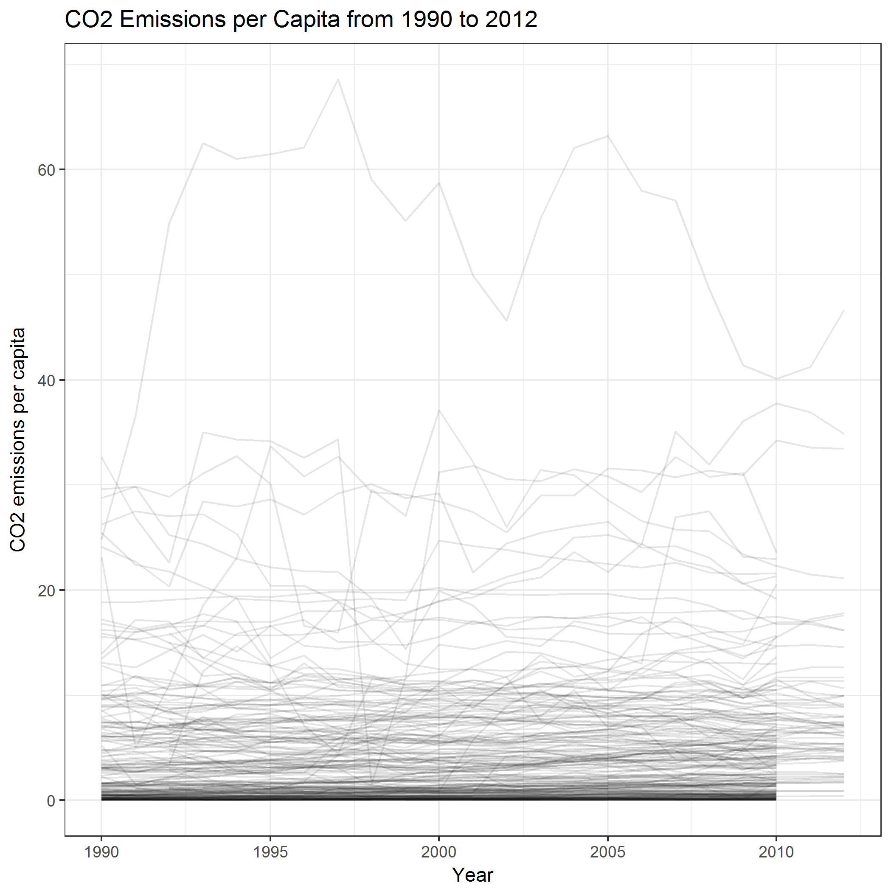
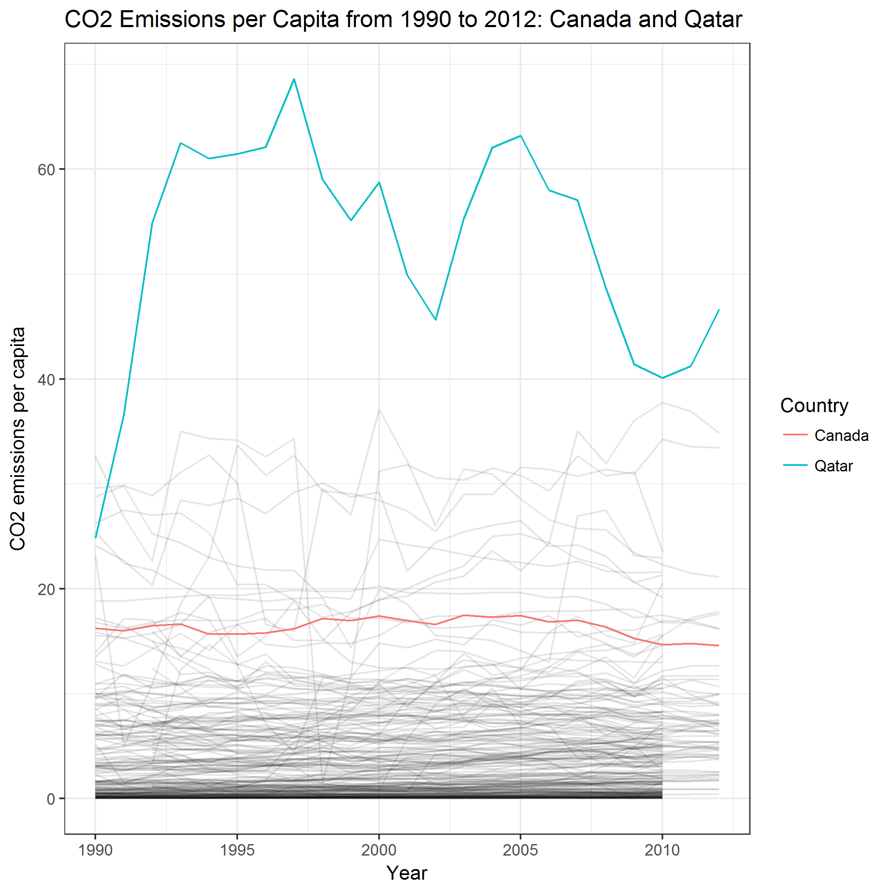
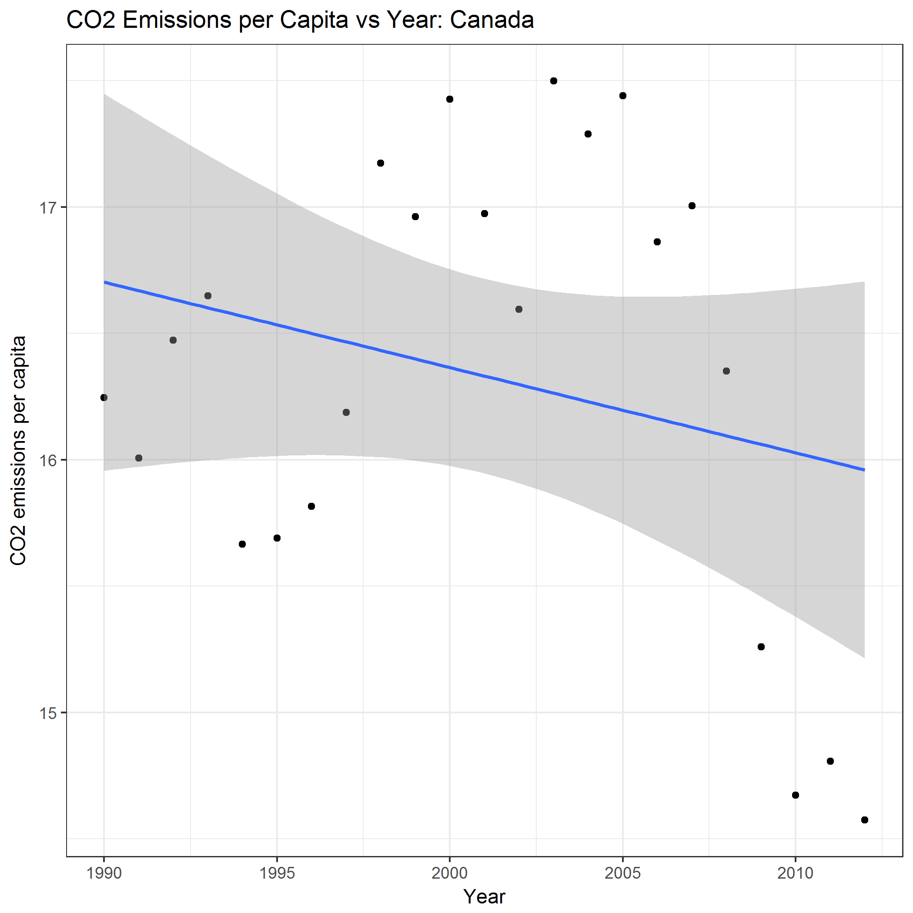

STAT 545M Homework 7 Report

For this assignment, I chose to look at data provided on the gapminder website, that was put together by the CDIAC (Carbon Dioxide Information Analysis Center). This data set had information for CO2 emissions per capita (in tonnes per person) from 236 countries, from 1751 to 2012. Due to several countries missing data until the early 1990's, I decided to only look at data from 1990 until 2012 for the purposes of this assignment.

As a departure point for exploring the data, a time series plot that graphs the trajectory of CO2 emissions per capita for all countries shows how countries across the world vary in their variability and degree of CO2 emissions since 1990.

Where does Canada fit in among this data?

From this visualization, it can be seen that Canada (highlighted in red) has been relatively stable in the amount of CO2 emissions produced across the last two decades, and is not particularly high or low compared to other countries.

There is a line that is clearly higher than the rest, and shows relatively extreme fluctuations compared to the rest of the lines in this graph - it is the trajectory of Qatar's CO2 emissions over the 22 years, and is highlighted in blue below.

Each country has very different patterns of fluctuations, but are their profiles one of average decrease or increase in CO2 emission across time?

For Canada, it appears that CO2 emissions have been gradually decreasing in more recent years.

And for Qatar, it also appears to be a picture of gradual decline in CO2 emissions, although less steep.

Despite the two vastly differing patterns of fluctuations shown by the two countries in their CO2 emissions, their profiles of CO2 decline appear relatively similar when visualized as linear regressions. 

