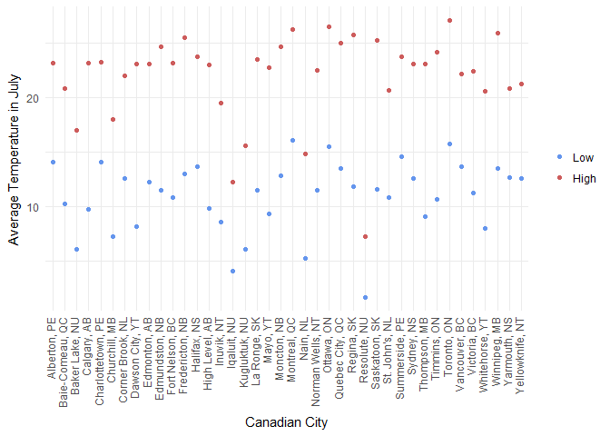
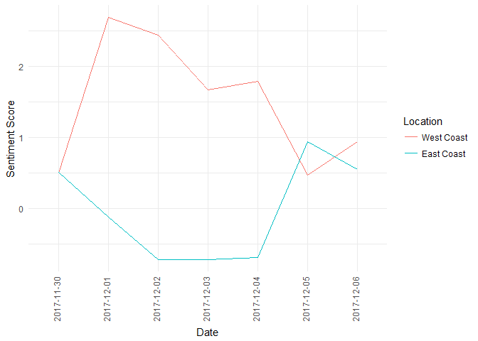

hw10
================
Victoria Michalowski
December 5, 2017

For this assignment, I wanted to try building on the scraping example we did in class, as well as try an API.

The first step was to load the required libraries that would be useful for either approach.

``` r
library(tidyverse)
```

    ## Loading tidyverse: ggplot2
    ## Loading tidyverse: tibble
    ## Loading tidyverse: tidyr
    ## Loading tidyverse: readr
    ## Loading tidyverse: purrr
    ## Loading tidyverse: dplyr

    ## Conflicts with tidy packages ----------------------------------------------

    ## filter(): dplyr, stats
    ## lag():    dplyr, stats

``` r
library(purrr)
library(glue)
```

    ## 
    ## Attaching package: 'glue'

    ## The following object is masked from 'package:dplyr':
    ## 
    ##     collapse

``` r
library(stringr)
```

Scraping data
=============

The libraries that I used specifcally for scraping data were the xml2 and rvest packages. I then read in the URL from which I would be scraping data from, and assigned it to "url\_CAtempwiki". The URL takes you to a wikipedia page on temperature in Canada.

My goal was to scrape data from a table on that page that had information about average temperatures across different major cities in Canada. In order to get the table within the webpage, I had to read in the webpage using the read\_html() function first:

``` r
library(xml2)
library(rvest)
```

    ## 
    ## Attaching package: 'rvest'

    ## The following object is masked from 'package:purrr':
    ## 
    ##     pluck

    ## The following object is masked from 'package:readr':
    ## 
    ##     guess_encoding

``` r
url_CAtempwiki <- "https://en.wikipedia.org/wiki/Temperature_in_Canada"
page_title <- read_html(url_CAtempwiki) 
head(page_title)
```

    ## $node
    ## <pointer: 0x000000000c06fd30>
    ## 
    ## $doc
    ## <pointer: 0x000000000c0507c0>

Now I can go into that webpage, and find the specific peice that I'm interested in scraping - the table of average temperatures in Canada. To do this, I used shift+ctrl+c to inspect the elements of the html page, and find the table element that I wanted. Once I had that, I saved it as a data frame.

``` r
temp_tableCA <- page_title %>% 
  # right click "..." beside the selected table element and copy the xpath
  html_nodes(xpath = '//*[@id="mw-content-text"]/div/table[1]') %>% 
  html_table

temp_tableCA <- as.data.frame(temp_tableCA)
head(temp_tableCA)
```

    ##              Community Weather.station
    ## 1      Alberton, PE[1]                
    ## 2    Baker Lake, NU[2]             YBK
    ## 3   Baie-Comeau, QC[3]             YBC
    ## 4       Calgary, AB[4]             YYC
    ## 5 Charlottetown, PE[5]             YYG
    ## 6     Churchill, MB[6]             YYQ
    ##                                                                                                                                  Location
    ## 1           46°51'00<U+2033>N 064°01'00<U+2033>W<U+FEFF> / <U+FEFF>46.85000°N 64.01667°W<U+FEFF> / 46.85000; -64.01667<U+FEFF> (Alberton)
    ## 2 64°17'56<U+2033>N 096°04'40<U+2033>W<U+FEFF> / <U+FEFF>64.29889°N 96.07778°W<U+FEFF> / 64.29889; -96.07778<U+FEFF> (Baker Lake Airport)
    ## 3        49°08'00<U+2033>N 068°12'00<U+2033>W<U+FEFF> / <U+FEFF>49.13333°N 68.20000°W<U+FEFF> / 49.13333; -68.20000<U+FEFF> (Baie-Comeau)
    ## 4          51°06'50<U+2033>N 114°01'13<U+2033>W<U+FEFF> / <U+FEFF>51.11389°N 114.02028°W<U+FEFF> / 51.11389; -114.02028<U+FEFF> (Calgary)
    ## 5      46°17'19<U+2033>N 063°07'43<U+2033>W<U+FEFF> / <U+FEFF>46.28861°N 63.12861°W<U+FEFF> / 46.28861; -63.12861<U+FEFF> (Charlottetown)
    ## 6          58°44'21<U+2033>N 094°03'59<U+2033>W<U+FEFF> / <U+FEFF>58.73917°N 94.06639°W<U+FEFF> / 58.73917; -94.06639<U+FEFF> (Churchill)
    ##                                       Elevation
    ## 1       7000300000000000000<U+2660>3 m (9.8 ft)
    ## 2                           18.6 metres (61 ft)
    ## 3       7001220000000000000<U+2660>22 m (72 ft)
    ## 4 7003108400000000000<U+2660>1,084 m (3,556 ft)
    ## 5      7001490000000000000<U+2660>49 m (161 ft)
    ## 6       7001290000000000000<U+2660>29 m (95 ft)
    ##                January.Avg..high..C...F..
    ## 1  7002269250000000000<U+2660>-3.9 (25.0)
    ## 2  7002271450000000000<U+2660>-1.7 (28.9)
    ## 3  7002264450000000000<U+2660>-8.7 (16.3)
    ## 4  7002272250000000000<U+2660>-0.9 (30.4)
    ## 5  7002269750000000000<U+2660>-3.4 (25.9)
    ## 6 7002251249999999999<U+2660>-21.9 (-7.4)
    ##                  January.Avg..low..C...F..
    ## 1   7002260649999999999<U+2660>-12.5 (9.5)
    ## 2 7002238349999999999<U+2660>-34.8 (-30.6)
    ## 3  7002253249999999999<U+2660>-19.9 (-3.8)
    ## 4   7002259950000000000<U+2660>-13.2 (8.2)
    ## 5  7002261049999999999<U+2660>-12.1 (10.2)
    ## 6 7002243049999999999<U+2660>-30.1 (-22.2)
    ##                  July.Avg..high..C...F..
    ## 1 7002296349999999999<U+2660>23.2 (73.8)
    ## 2 7002290150000000000<U+2660>17.0 (62.6)
    ## 3 7002294049999999999<U+2660>20.9 (69.6)
    ## 4 7002296349999999999<U+2660>23.2 (73.8)
    ## 5 7002296450000000000<U+2660>23.3 (73.9)
    ## 6 7002291150000000000<U+2660>18.0 (64.4)
    ##                   July.Avg..low..C...F..
    ## 1 7002287250000000000<U+2660>14.1 (57.4)
    ## 2  7002279250000000000<U+2660>6.1 (43.0)
    ## 3 7002283450000000000<U+2660>10.3 (50.5)
    ## 4  7002282950000000000<U+2660>9.8 (49.6)
    ## 5 7002287250000000000<U+2660>14.1 (57.4)
    ## 6  7002280450000000000<U+2660>7.3 (45.1)
    ##                Annual.Avg..high..C...F..
    ## 1  7002282750000000000<U+2660>9.6 (49.3)
    ## 2 7002265849999999999<U+2660>-7.3 (18.9)
    ## 3  7002279750000000000<U+2660>6.6 (43.9)
    ## 4 7002283950000000000<U+2660>10.8 (51.4)
    ## 5  7002283049999999999<U+2660>9.9 (49.8)
    ## 6 7002270849999999999<U+2660>-2.3 (27.9)
    ##                  Annual.Avg..low..C...F..
    ## 1   7002274450000000000<U+2660>1.3 (34.3)
    ## 2  7002257950000000000<U+2660>-15.2 (4.6)
    ## 3  7002269849999999999<U+2660>-3.3 (26.1)
    ## 4  7002271250000000000<U+2660>-1.9 (28.6)
    ## 5   7002274450000000000<U+2660>1.3 (34.3)
    ## 6 7002262450000000000<U+2660>-10.7 (12.7)

Now that the table is saved as a data frame, I could go in and clean the data, which for what I wanted to do, involved removing excess characters from the community and temperature variables.

``` r
# remove citation source (e.g. [1], [10]) from community variable text

temp_tableCA_clean_1 <- temp_tableCA %>% 
  head(n=9) %>% 
  mutate(Community1 = str_sub(Community, 1, nchar(Community)-3))
head(temp_tableCA_clean_1)
```

    ##              Community Weather.station
    ## 1      Alberton, PE[1]                
    ## 2    Baker Lake, NU[2]             YBK
    ## 3   Baie-Comeau, QC[3]             YBC
    ## 4       Calgary, AB[4]             YYC
    ## 5 Charlottetown, PE[5]             YYG
    ## 6     Churchill, MB[6]             YYQ
    ##                                                                                                                                  Location
    ## 1           46°51'00<U+2033>N 064°01'00<U+2033>W<U+FEFF> / <U+FEFF>46.85000°N 64.01667°W<U+FEFF> / 46.85000; -64.01667<U+FEFF> (Alberton)
    ## 2 64°17'56<U+2033>N 096°04'40<U+2033>W<U+FEFF> / <U+FEFF>64.29889°N 96.07778°W<U+FEFF> / 64.29889; -96.07778<U+FEFF> (Baker Lake Airport)
    ## 3        49°08'00<U+2033>N 068°12'00<U+2033>W<U+FEFF> / <U+FEFF>49.13333°N 68.20000°W<U+FEFF> / 49.13333; -68.20000<U+FEFF> (Baie-Comeau)
    ## 4          51°06'50<U+2033>N 114°01'13<U+2033>W<U+FEFF> / <U+FEFF>51.11389°N 114.02028°W<U+FEFF> / 51.11389; -114.02028<U+FEFF> (Calgary)
    ## 5      46°17'19<U+2033>N 063°07'43<U+2033>W<U+FEFF> / <U+FEFF>46.28861°N 63.12861°W<U+FEFF> / 46.28861; -63.12861<U+FEFF> (Charlottetown)
    ## 6          58°44'21<U+2033>N 094°03'59<U+2033>W<U+FEFF> / <U+FEFF>58.73917°N 94.06639°W<U+FEFF> / 58.73917; -94.06639<U+FEFF> (Churchill)
    ##                                       Elevation
    ## 1       7000300000000000000<U+2660>3 m (9.8 ft)
    ## 2                           18.6 metres (61 ft)
    ## 3       7001220000000000000<U+2660>22 m (72 ft)
    ## 4 7003108400000000000<U+2660>1,084 m (3,556 ft)
    ## 5      7001490000000000000<U+2660>49 m (161 ft)
    ## 6       7001290000000000000<U+2660>29 m (95 ft)
    ##                January.Avg..high..C...F..
    ## 1  7002269250000000000<U+2660>-3.9 (25.0)
    ## 2  7002271450000000000<U+2660>-1.7 (28.9)
    ## 3  7002264450000000000<U+2660>-8.7 (16.3)
    ## 4  7002272250000000000<U+2660>-0.9 (30.4)
    ## 5  7002269750000000000<U+2660>-3.4 (25.9)
    ## 6 7002251249999999999<U+2660>-21.9 (-7.4)
    ##                  January.Avg..low..C...F..
    ## 1   7002260649999999999<U+2660>-12.5 (9.5)
    ## 2 7002238349999999999<U+2660>-34.8 (-30.6)
    ## 3  7002253249999999999<U+2660>-19.9 (-3.8)
    ## 4   7002259950000000000<U+2660>-13.2 (8.2)
    ## 5  7002261049999999999<U+2660>-12.1 (10.2)
    ## 6 7002243049999999999<U+2660>-30.1 (-22.2)
    ##                  July.Avg..high..C...F..
    ## 1 7002296349999999999<U+2660>23.2 (73.8)
    ## 2 7002290150000000000<U+2660>17.0 (62.6)
    ## 3 7002294049999999999<U+2660>20.9 (69.6)
    ## 4 7002296349999999999<U+2660>23.2 (73.8)
    ## 5 7002296450000000000<U+2660>23.3 (73.9)
    ## 6 7002291150000000000<U+2660>18.0 (64.4)
    ##                   July.Avg..low..C...F..
    ## 1 7002287250000000000<U+2660>14.1 (57.4)
    ## 2  7002279250000000000<U+2660>6.1 (43.0)
    ## 3 7002283450000000000<U+2660>10.3 (50.5)
    ## 4  7002282950000000000<U+2660>9.8 (49.6)
    ## 5 7002287250000000000<U+2660>14.1 (57.4)
    ## 6  7002280450000000000<U+2660>7.3 (45.1)
    ##                Annual.Avg..high..C...F..
    ## 1  7002282750000000000<U+2660>9.6 (49.3)
    ## 2 7002265849999999999<U+2660>-7.3 (18.9)
    ## 3  7002279750000000000<U+2660>6.6 (43.9)
    ## 4 7002283950000000000<U+2660>10.8 (51.4)
    ## 5  7002283049999999999<U+2660>9.9 (49.8)
    ## 6 7002270849999999999<U+2660>-2.3 (27.9)
    ##                  Annual.Avg..low..C...F..        Community1
    ## 1   7002274450000000000<U+2660>1.3 (34.3)      Alberton, PE
    ## 2  7002257950000000000<U+2660>-15.2 (4.6)    Baker Lake, NU
    ## 3  7002269849999999999<U+2660>-3.3 (26.1)   Baie-Comeau, QC
    ## 4  7002271250000000000<U+2660>-1.9 (28.6)       Calgary, AB
    ## 5   7002274450000000000<U+2660>1.3 (34.3) Charlottetown, PE
    ## 6 7002262450000000000<U+2660>-10.7 (12.7)     Churchill, MB

``` r
temp_tableCA_clean_2 <- temp_tableCA %>% 
  tail(n=31) %>% 
  mutate(Community1 = str_sub(Community, 1, nchar(Community)-4))
head(temp_tableCA_clean_2)
```

    ##             Community Weather.station
    ## 1  Edmundston, NB[10]                
    ## 2 Fort Nelson, BC[11]             YYE
    ## 3 Fredericton, NB[12]             YFC
    ## 4     Halifax, NS[13]             YHZ
    ## 5  High Level, AB[14]             YOJ
    ## 6      Inuvik, NT[15]             YEV
    ##                                                                                                                             Location
    ## 1    47°20'47<U+2033>N 068°11'16<U+2033>W<U+FEFF> / <U+FEFF>47.34639°N 68.18778°W<U+FEFF> / 47.34639; -68.18778<U+FEFF> (Edmundston)
    ## 2 58°50'11<U+2033>N 122°35'50<U+2033>W<U+FEFF> / <U+FEFF>58.83639°N 122.59722°W<U+FEFF> / 58.83639; -122.59722<U+FEFF> (Fort Nelson)
    ## 3   45°52'20<U+2033>N 066°31'40<U+2033>W<U+FEFF> / <U+FEFF>45.87222°N 66.52778°W<U+FEFF> / 45.87222; -66.52778<U+FEFF> (Fredericton)
    ## 4       44°52'48<U+2033>N 063°30'00<U+2033>W<U+FEFF> / <U+FEFF>44.88000°N 63.50000°W<U+FEFF> / 44.88000; -63.50000<U+FEFF> (Halifax)
    ## 5  58°37'17<U+2033>N 117°09'53<U+2033>W<U+FEFF> / <U+FEFF>58.62139°N 117.16472°W<U+FEFF> / 58.62139; -117.16472<U+FEFF> (High Level)
    ## 6      68°18'15<U+2033>N 133°28'58<U+2033>W<U+FEFF> / <U+FEFF>68.30417°N 133.48278°W<U+FEFF> / 68.30417; -133.48278<U+FEFF> (Inuvik)
    ##                                     Elevation
    ## 1   7002163000000000000<U+2660>163 m (535 ft)
    ## 2 7002382000000000000<U+2660>382 m (1,253 ft)
    ## 3     7001210000000000000<U+2660>21 m (69 ft)
    ## 4   7002145000000000000<U+2660>145 m (476 ft)
    ## 5 7002338000000000000<U+2660>338 m (1,109 ft)
    ## 6    7001680000000000000<U+2660>68 m (223 ft)
    ##                January.Avg..high..C...F..
    ## 1  7002266049999999999<U+2660>-7.1 (19.2)
    ## 2  7002257049999999999<U+2660>-16.1 (3.0)
    ## 3  7002269349999999999<U+2660>-3.8 (25.2)
    ## 4  7002271849999999999<U+2660>-1.3 (29.7)
    ## 5  7002258149999999999<U+2660>-15.0 (5.0)
    ## 6 7002250349999999999<U+2660>-22.8 (-9.0)
    ##                  January.Avg..low..C...F..
    ## 1  7002254649999999999<U+2660>-18.5 (-1.3)
    ## 2 7002248549999999999<U+2660>-24.6 (-12.3)
    ## 3   7002258149999999999<U+2660>-15.0 (5.0)
    ## 4  7002262750000000000<U+2660>-10.4 (13.3)
    ## 5 7002247349999999999<U+2660>-25.8 (-14.4)
    ## 6 7002242149999999999<U+2660>-31.0 (-23.8)
    ##                  July.Avg..high..C...F..
    ## 1 7002297849999999999<U+2660>24.7 (76.5)
    ## 2 7002296349999999999<U+2660>23.2 (73.8)
    ## 3 7002298650000000000<U+2660>25.5 (77.9)
    ## 4 7002296950000000000<U+2660>23.8 (74.8)
    ## 5 7002296150000000000<U+2660>23.0 (73.4)
    ## 6 7002292650000000000<U+2660>19.5 (67.1)
    ##                   July.Avg..low..C...F..
    ## 1 7002284650000000000<U+2660>11.5 (52.7)
    ## 2 7002284049999999999<U+2660>10.9 (51.6)
    ## 3 7002286150000000000<U+2660>13.0 (55.4)
    ## 4 7002286849999999999<U+2660>13.7 (56.7)
    ## 5  7002283049999999999<U+2660>9.9 (49.8)
    ## 6  7002281750000000000<U+2660>8.6 (47.5)
    ##                Annual.Avg..high..C...F..
    ## 1  7002282650000000000<U+2660>9.5 (49.1)
    ## 2  7002278349999999999<U+2660>5.2 (41.4)
    ## 3 7002284549999999999<U+2660>11.4 (52.5)
    ## 4 7002284450000000000<U+2660>11.3 (52.3)
    ## 5  7002278349999999999<U+2660>5.2 (41.4)
    ## 6 7002269649999999999<U+2660>-3.5 (25.7)
    ##                 Annual.Avg..low..C...F..      Community1
    ## 1 7002270849999999999<U+2660>-2.3 (27.9)  Edmundston, NB
    ## 2 7002267149999999999<U+2660>-6.0 (21.2) Fort Nelson, BC
    ## 3 7002272950000000000<U+2660>-0.2 (31.6) Fredericton, NB
    ## 4  7002275049999999999<U+2660>1.9 (35.4)     Halifax, NS
    ## 5 7002265950000000000<U+2660>-7.2 (19.0)  High Level, AB
    ## 6 7002260250000000000<U+2660>-12.9 (8.8)      Inuvik, NT

``` r
temp_tableCA_clean_3 <- bind_rows(temp_tableCA_clean_1, temp_tableCA_clean_2)
head(temp_tableCA_clean_3)
```

    ##              Community Weather.station
    ## 1      Alberton, PE[1]                
    ## 2    Baker Lake, NU[2]             YBK
    ## 3   Baie-Comeau, QC[3]             YBC
    ## 4       Calgary, AB[4]             YYC
    ## 5 Charlottetown, PE[5]             YYG
    ## 6     Churchill, MB[6]             YYQ
    ##                                                                                                                                  Location
    ## 1           46°51'00<U+2033>N 064°01'00<U+2033>W<U+FEFF> / <U+FEFF>46.85000°N 64.01667°W<U+FEFF> / 46.85000; -64.01667<U+FEFF> (Alberton)
    ## 2 64°17'56<U+2033>N 096°04'40<U+2033>W<U+FEFF> / <U+FEFF>64.29889°N 96.07778°W<U+FEFF> / 64.29889; -96.07778<U+FEFF> (Baker Lake Airport)
    ## 3        49°08'00<U+2033>N 068°12'00<U+2033>W<U+FEFF> / <U+FEFF>49.13333°N 68.20000°W<U+FEFF> / 49.13333; -68.20000<U+FEFF> (Baie-Comeau)
    ## 4          51°06'50<U+2033>N 114°01'13<U+2033>W<U+FEFF> / <U+FEFF>51.11389°N 114.02028°W<U+FEFF> / 51.11389; -114.02028<U+FEFF> (Calgary)
    ## 5      46°17'19<U+2033>N 063°07'43<U+2033>W<U+FEFF> / <U+FEFF>46.28861°N 63.12861°W<U+FEFF> / 46.28861; -63.12861<U+FEFF> (Charlottetown)
    ## 6          58°44'21<U+2033>N 094°03'59<U+2033>W<U+FEFF> / <U+FEFF>58.73917°N 94.06639°W<U+FEFF> / 58.73917; -94.06639<U+FEFF> (Churchill)
    ##                                       Elevation
    ## 1       7000300000000000000<U+2660>3 m (9.8 ft)
    ## 2                           18.6 metres (61 ft)
    ## 3       7001220000000000000<U+2660>22 m (72 ft)
    ## 4 7003108400000000000<U+2660>1,084 m (3,556 ft)
    ## 5      7001490000000000000<U+2660>49 m (161 ft)
    ## 6       7001290000000000000<U+2660>29 m (95 ft)
    ##                January.Avg..high..C...F..
    ## 1  7002269250000000000<U+2660>-3.9 (25.0)
    ## 2  7002271450000000000<U+2660>-1.7 (28.9)
    ## 3  7002264450000000000<U+2660>-8.7 (16.3)
    ## 4  7002272250000000000<U+2660>-0.9 (30.4)
    ## 5  7002269750000000000<U+2660>-3.4 (25.9)
    ## 6 7002251249999999999<U+2660>-21.9 (-7.4)
    ##                  January.Avg..low..C...F..
    ## 1   7002260649999999999<U+2660>-12.5 (9.5)
    ## 2 7002238349999999999<U+2660>-34.8 (-30.6)
    ## 3  7002253249999999999<U+2660>-19.9 (-3.8)
    ## 4   7002259950000000000<U+2660>-13.2 (8.2)
    ## 5  7002261049999999999<U+2660>-12.1 (10.2)
    ## 6 7002243049999999999<U+2660>-30.1 (-22.2)
    ##                  July.Avg..high..C...F..
    ## 1 7002296349999999999<U+2660>23.2 (73.8)
    ## 2 7002290150000000000<U+2660>17.0 (62.6)
    ## 3 7002294049999999999<U+2660>20.9 (69.6)
    ## 4 7002296349999999999<U+2660>23.2 (73.8)
    ## 5 7002296450000000000<U+2660>23.3 (73.9)
    ## 6 7002291150000000000<U+2660>18.0 (64.4)
    ##                   July.Avg..low..C...F..
    ## 1 7002287250000000000<U+2660>14.1 (57.4)
    ## 2  7002279250000000000<U+2660>6.1 (43.0)
    ## 3 7002283450000000000<U+2660>10.3 (50.5)
    ## 4  7002282950000000000<U+2660>9.8 (49.6)
    ## 5 7002287250000000000<U+2660>14.1 (57.4)
    ## 6  7002280450000000000<U+2660>7.3 (45.1)
    ##                Annual.Avg..high..C...F..
    ## 1  7002282750000000000<U+2660>9.6 (49.3)
    ## 2 7002265849999999999<U+2660>-7.3 (18.9)
    ## 3  7002279750000000000<U+2660>6.6 (43.9)
    ## 4 7002283950000000000<U+2660>10.8 (51.4)
    ## 5  7002283049999999999<U+2660>9.9 (49.8)
    ## 6 7002270849999999999<U+2660>-2.3 (27.9)
    ##                  Annual.Avg..low..C...F..        Community1
    ## 1   7002274450000000000<U+2660>1.3 (34.3)      Alberton, PE
    ## 2  7002257950000000000<U+2660>-15.2 (4.6)    Baker Lake, NU
    ## 3  7002269849999999999<U+2660>-3.3 (26.1)   Baie-Comeau, QC
    ## 4  7002271250000000000<U+2660>-1.9 (28.6)       Calgary, AB
    ## 5   7002274450000000000<U+2660>1.3 (34.3) Charlottetown, PE
    ## 6 7002262450000000000<U+2660>-10.7 (12.7)     Churchill, MB

``` r
# clean up temperature vars

temp_tableCA_clean_4 <- temp_tableCA_clean_3 %>% 
  mutate(July_Avg_High = substr(July.Avg..high..C...F.., start = 21, stop = 24)) %>% 
  mutate(July_Avg_High = str_trim(July_Avg_High, side = "both")) %>% 
  mutate(July_Avg_Low = substr(July.Avg..low..C...F.., start = 21, stop = 24)) %>% 
  mutate(July_Avg_Low = str_trim(July_Avg_Low, side = "both")) %>% 
  select(Community1, July_Avg_High, July_Avg_Low)

temp_tableCA_clean_4$July_Avg_High <- as.numeric(temp_tableCA_clean_4$July_Avg_High)
temp_tableCA_clean_4$July_Avg_Low <- as.numeric(temp_tableCA_clean_4$July_Avg_Low)

head(temp_tableCA_clean_4)
```

    ##          Community1 July_Avg_High July_Avg_Low
    ## 1      Alberton, PE          23.2         14.1
    ## 2    Baker Lake, NU          17.0          6.1
    ## 3   Baie-Comeau, QC          20.9         10.3
    ## 4       Calgary, AB          23.2          9.8
    ## 5 Charlottetown, PE          23.3         14.1
    ## 6     Churchill, MB          18.0          7.3

With the cleaned data, I then created a plot to visualize differences between average high and low temperatures in July across the different major cities.

``` r
# make summary plot

p2 <- temp_tableCA_clean_4 %>% 
  ggplot(aes(x=Community1, y=July_Avg_High, colour="indianred")) +
  geom_point() +
  geom_point(data = temp_tableCA_clean_4, aes(x=Community1, July_Avg_Low, 
                                               colour="cornflowerblue")) +
  scale_x_discrete("Canadian City") +
  scale_y_continuous("Average Temperature in July") +
  scale_color_manual(name="", labels=c("Low", "High"), values = c("cornflowerblue", "indianred")) +
  theme_minimal() +
  theme(axis.text.x = element_text(angle=90, vjust=.2, hjust = 1))
p2
```



Now it is easy to visually pick out cities of interest and see their averages, and compare them to other cities in Canada.

This is the same data that was on the wikipedia page, but that was listed in table form instead, so it's not that interesting in itself. The exciting part is that I can take that data and have the freedom to explore it however I want to, and potentially combine it with other data sets to answer unique questions.

Using an API
============

Several sites have APIs available to developers, such as FitBit, Spotify, and what I ultimately chose to explore, Twitter. I went with Twitter for the purposes of this assignment because it is widely scraped, and so there are lots of resources, and even packages that streamline the scraping process. As such, it was a nice introduction exercise to using an API, but I definitely want to try others in the future, potentially without pre-built packages that make it easy.

I found the package twitteR seemed to be the most widely used and had a set of nice functions. The first step (when using any API) was to set up a developer account and set up OAuth credentials - these credentials are supposed to be kept private, so I read them in from a seperate script, and kept the skeleton of the code as a comment below.

``` r
library(twitteR)
```

    ## 
    ## Attaching package: 'twitteR'

    ## The following objects are masked from 'package:dplyr':
    ## 
    ##     id, location

``` r
source("APIcred_twitter.R")
```

    ## [1] "Using browser based authentication"

``` r
# setup_twitter_oauth("xxxxxxxxxxxxxxxxx", "xxxxxxxxxxxxxxxxxxxxxxx", NULL, NULL)
```

Keeping with the weather theme, and loosely inspired by a public data set I saw on CrowdFlower (<https://www.crowdflower.com/data-for-everyone/>) that looked at sentiment towards weather in tweets, I thought it would be interesting to do a sentiment analysis of rain-related tweets. To add some complexity, I looked at tweets from the Pacific Northwest as well as tweets from the East Coast, and compared the two.

The searchTwitter function allows you to specify several features of the tweets you are scraping, and for my purposes, I wanted tweets regarding rain, in English, and specified coordinates for Vancouver, and the entire 1000 mile radius surrounding it. I also specified a time frame, but I noticed that I could only get tweets from the past several days, regardless of the time frame specified.

``` r
# West Coast

rain_tweets_wc <- searchTwitter('rain', n = 1500, lang='en', since = '2017-09-01', until = '2017-12-07', geocode = '49.2827,123.1207,1000mi')
```

Once I had the tweets, I converted them from a list into a data frame using the twListToDF() function.

``` r
rain_tweets_wc_1 <- twListToDF(rain_tweets_wc)
head(rain_tweets_wc_1)
```

    ##                                                                                                                                          text
    ## 1                                                                                                           #PickOne Rain Sound / Secret Love
    ## 2                                          RT @SJ12th87: I wanna hold you close,\nUnder the rain\nI wanna kiss your smile,\nAnd feel the pain
    ## 3 RT @JayScotland: Today's wicked winds continue to ease and the sky will clear this evening. Some sunshine returns for Thursday morning but…
    ## 4                                                                                                                 #PickOne Power / Rain Sound
    ## 5                                                                                          Is professor yoo the bitter non ex from love rain?
    ## 6 RT @JayScotland: Today's wicked winds continue to ease and the sky will clear this evening. Some sunshine returns for Thursday morning but…
    ##   favorited favoriteCount replyToSN             created truncated
    ## 1     FALSE             0      <NA> 2017-12-06 23:54:21     FALSE
    ## 2     FALSE             0      <NA> 2017-12-06 23:49:40     FALSE
    ## 3     FALSE             0      <NA> 2017-12-06 23:34:21     FALSE
    ## 4     FALSE             0      <NA> 2017-12-06 23:24:35     FALSE
    ## 5     FALSE             0      <NA> 2017-12-06 23:08:25     FALSE
    ## 6     FALSE             0      <NA> 2017-12-06 23:05:16     FALSE
    ##   replyToSID                 id replyToUID
    ## 1       <NA> 938557253145182208       <NA>
    ## 2       <NA> 938556074621157376       <NA>
    ## 3       <NA> 938552219003211778       <NA>
    ## 4       <NA> 938549761946279936       <NA>
    ## 5       <NA> 938545695216230401       <NA>
    ## 6       <NA> 938544903352733697       <NA>
    ##                                                                           statusSource
    ## 1                       <a href="http://twittbot.net/" rel="nofollow">twittbot.net</a>
    ## 2                 <a href="https://mobile.twitter.com" rel="nofollow">Twitter Lite</a>
    ## 3   <a href="http://twitter.com/download/iphone" rel="nofollow">Twitter for iPhone</a>
    ## 4                       <a href="http://twittbot.net/" rel="nofollow">twittbot.net</a>
    ## 5 <a href="http://twitter.com/download/android" rel="nofollow">Twitter for Android</a>
    ## 6                   <a href="http://twitter.com" rel="nofollow">Twitter Web Client</a>
    ##        screenName retweetCount isRetweet retweeted longitude latitude
    ## 1     bangtanagus            0     FALSE     FALSE      <NA>     <NA>
    ## 2      fyoonalims            1      TRUE     FALSE      <NA>     <NA>
    ## 3 LogManMaritimes            2      TRUE     FALSE      <NA>     <NA>
    ## 4     bangtanagus            0     FALSE     FALSE      <NA>     <NA>
    ## 5       bulbaseok            0     FALSE     FALSE      <NA>     <NA>
    ## 6     AtlCanCaper            2      TRUE     FALSE      <NA>     <NA>

Once I had all of the information in data frame form, I could then clean up the variables I wanted.

``` r
rain_tweets_wc_2 <- rain_tweets_wc_1 %>% 
  select(text, created) %>% 
  mutate(location = 1) %>% #create a var to specify that these are west coast tweets
  mutate(date = substr(created, start = 1, stop = 10)) %>%  #split up data and time into two seperate vars
  mutate(time = substr(created, start = 12, stop = 19)) %>% 
  select(text, location, date, time) #only keep these vars
head(rain_tweets_wc_2)
```

    ##                                                                                                                                          text
    ## 1                                                                                                           #PickOne Rain Sound / Secret Love
    ## 2                                          RT @SJ12th87: I wanna hold you close,\nUnder the rain\nI wanna kiss your smile,\nAnd feel the pain
    ## 3 RT @JayScotland: Today's wicked winds continue to ease and the sky will clear this evening. Some sunshine returns for Thursday morning but…
    ## 4                                                                                                                 #PickOne Power / Rain Sound
    ## 5                                                                                          Is professor yoo the bitter non ex from love rain?
    ## 6 RT @JayScotland: Today's wicked winds continue to ease and the sky will clear this evening. Some sunshine returns for Thursday morning but…
    ##   location       date     time
    ## 1        1 2017-12-06 23:54:21
    ## 2        1 2017-12-06 23:49:40
    ## 3        1 2017-12-06 23:34:21
    ## 4        1 2017-12-06 23:24:35
    ## 5        1 2017-12-06 23:08:25
    ## 6        1 2017-12-06 23:05:16

And then I did the same thing for East Coast tweets, which were specified as coming from a 1000 mile radius of Toronto.

``` r
# East Coast

rain_tweets_ec <- searchTwitter('rain', n = 1500, lang='en', since = '2017-09-01', until = '2017-12-07', geocode = '43.6532,79.3832,1000mi') 

rain_tweets_ec_1 <- twListToDF(rain_tweets_ec)

rain_tweets_ec_2 <- rain_tweets_ec_1 %>% 
  select(text, created) %>% 
  mutate(location = 2) %>% 
  mutate(date = substr(created, start = 1, stop = 10)) %>% 
  mutate(time = substr(created, start = 12, stop = 19)) %>% 
  select(text, location, date, time)
head(rain_tweets_ec_2)
```

    ##                                                                                                                                           text
    ## 1                                          Wind 3.8 mph WNW. Barometer 30.00 in, Rising. Temperature 18.3 °F. Rain today 0.00 in. Humidity 77%
    ## 2                                    Wind 7.6 mph SW. Barometer 29.92 in, Rising slowly. Temperature 29.1 °F. Rain today 0.00 in. Humidity 43%
    ## 3 Update, I've had no time to nap, or cook today, and I have so many layers on that it was raining and I not a single… https://t.co/OfvKj7Ra8J
    ## 4                                     Wind 5.4 mph W. Barometer 29.92 in, Rising slowly. Temperature 30.0 °F. Rain today 0.00 in. Humidity 42%
    ## 5                                                              left me wit a heavy heart, but ima always make it thru the rain no matter what.
    ## 6                                     Wind 5.4 mph W. Barometer 29.92 in, Rising slowly. Temperature 30.6 °F. Rain today 0.00 in. Humidity 41%
    ##   location       date     time
    ## 1        2 2017-12-06 23:59:55
    ## 2        2 2017-12-06 23:45:00
    ## 3        2 2017-12-06 23:30:06
    ## 4        2 2017-12-06 23:30:01
    ## 5        2 2017-12-06 23:19:06
    ## 6        2 2017-12-06 23:15:01

And now that I had two parallel data sets from each coast, I could join them together.

``` r
# Join data from both coasts

rain_tweets <- bind_rows(rain_tweets_ec_2, rain_tweets_wc_2)
head(rain_tweets)
```

    ##                                                                                                                                           text
    ## 1                                          Wind 3.8 mph WNW. Barometer 30.00 in, Rising. Temperature 18.3 °F. Rain today 0.00 in. Humidity 77%
    ## 2                                    Wind 7.6 mph SW. Barometer 29.92 in, Rising slowly. Temperature 29.1 °F. Rain today 0.00 in. Humidity 43%
    ## 3 Update, I've had no time to nap, or cook today, and I have so many layers on that it was raining and I not a single… https://t.co/OfvKj7Ra8J
    ## 4                                     Wind 5.4 mph W. Barometer 29.92 in, Rising slowly. Temperature 30.0 °F. Rain today 0.00 in. Humidity 42%
    ## 5                                                              left me wit a heavy heart, but ima always make it thru the rain no matter what.
    ## 6                                     Wind 5.4 mph W. Barometer 29.92 in, Rising slowly. Temperature 30.6 °F. Rain today 0.00 in. Humidity 41%
    ##   location       date     time
    ## 1        2 2017-12-06 23:59:55
    ## 2        2 2017-12-06 23:45:00
    ## 3        2 2017-12-06 23:30:06
    ## 4        2 2017-12-06 23:30:01
    ## 5        2 2017-12-06 23:19:06
    ## 6        2 2017-12-06 23:15:01

Now that I had all the rain-related tweets in a single data frame, I could use the data for further analysis. So I did a sentiment analysis to see whether people from the East Coast feel differently about rain than people from the West Coast, where we are much more used to it.

The first step here was to load the tidytext package, and decide which lexicon I wanted to use - I went with afinn this time, so that I could get a sentiment score that would be nice to plot later on.

``` r
# Sentiment analysis

library(tidytext)

afinn <- get_sentiments("afinn")
```

Then I took my data frame containing rain-related tweets, and created a sentiment score for each tweeted word.

Some caveats to this apporach to sentiment analysis are that this analysis does not account for sarcasm, differences between "it's not like it rains all the time" and "I like the rain", and users may also have the word "rain" in their usernames, but not actually always be tweeting about rain itself.

``` r
rain_tweets_1 <- rain_tweets %>% 
  unnest_tokens(word, text) %>% # gives each word from each tweet it's own row
  anti_join(stop_words, by = "word") %>%  # removes dull words
  inner_join(afinn, by = "word") %>%  # create a score variable
  group_by(location, date) %>%
  summarize(Length = n(), Score = sum(score)/Length) # final sentiment score by date and location

rain_tweets_1$location <- as.factor(rain_tweets_1$location) # convert location into a factor for graphing purposes

head(rain_tweets_1)
```

    ## # A tibble: 6 x 4
    ## # Groups:   location [1]
    ##   location       date Length     Score
    ##     <fctr>      <chr>  <int>     <dbl>
    ## 1        1 2017-11-30     58 0.5000000
    ## 2        1 2017-12-01    546 2.6868132
    ## 3        1 2017-12-02    200 2.4400000
    ## 4        1 2017-12-03    159 1.6666667
    ## 5        1 2017-12-04    133 1.7819549
    ## 6        1 2017-12-05     84 0.4642857

And now that I created a sentiment score for each tweet by location and date, I can plot them to visualize how East Coasters feel about rain compared to West Coasters, across the last several days.

``` r
p1 <- rain_tweets_1 %>% 
  ggplot(aes(y=Score, x=date, group=location)) +
  geom_line(aes(colour=location)) +
  scale_x_discrete("Date") +
  scale_y_continuous("Sentiment Score") +
  scale_color_discrete(name="Location", labels=c("West Coast", "East Coast")) +
  theme_minimal() +
  theme(axis.text.x = element_text(angle=90, vjust=.2, hjust = 1))
p1
```



There we have it! From this plot, it looks like West Coasters tend to feel more positively about rain than East Coasters.

As I mentioned earlier, I think some really exciting, but advanced, next steps would be to check out different APIs, and make use of the ever-expanding data available on the web.
